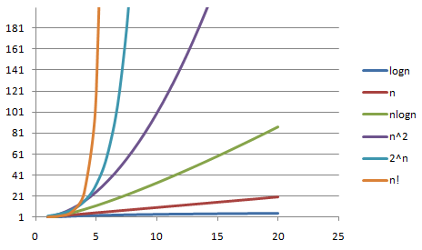
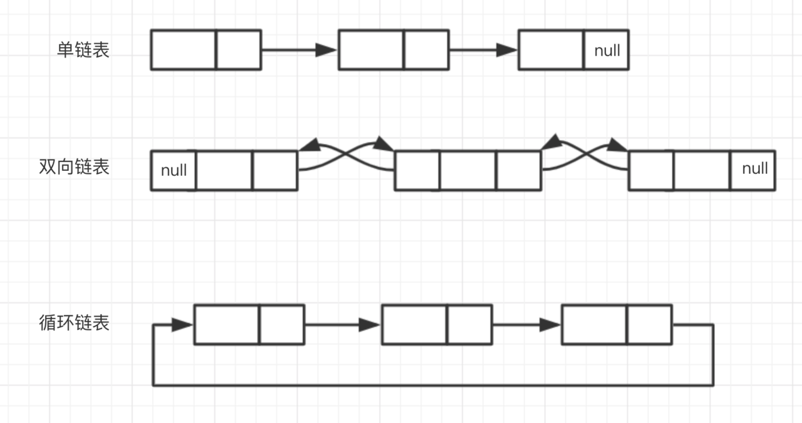
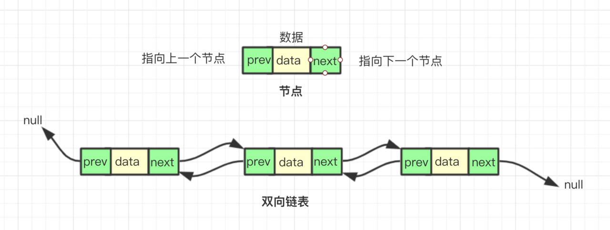

# 算法

时间复杂度O(n)



## 栈和队列

::: tip 栈和队列

​		几乎所有的编程语言都原生支持数组类型，因为数组是最简单的内存数据结构。javascript也有数组类型，而数组呢，其实就是一种特殊的栈或是队列，利用javascript **Array**所内置的API可以很方便的模拟栈和队列。

::: 

### 栈

::: tip 栈

在计算机科学中, 一个 **栈(stack)** 是一种抽象数据类型,用作表示元素的集合,具有两种主要操作:

- **push**, 添加元素到栈的顶端(末尾);
- **pop**, 移除栈最顶端(末尾)的元素.

以上两种操作可以简单概括为“后进先出(LIFO = last in, first out)”。

此外,应有一个 `peek` 操作用于访问栈当前顶端(末尾)的元素。

"栈"这个名称,可类比于一组物体的堆叠(一摞书,一摞盘子之类的)。

::: 

栈的 push 和 pop 操作的示意：


#### 栈的创建

我们需要给栈声明一些方法：

- **push**(element):添加一个或是几个新元素到栈顶。
- **pop**():移除栈顶的元素，同时返回被移除元素。
- **peek**():返回栈顶的元素，但并不对栈顶的元素做出任何的修改。
- isEmpty():检查栈内是否有元素，如果有返回true，没有返回false。
- clear():清除栈里的元素。
- size():返回栈的元素个数。
- print():打印栈里的元素。

#### 栈的完整代码

我们通过javascript提供的API，实现栈如下：

```js
function Stack() {

    var items = [];

    this.push = function(element){
        items.push(element);
    };

    this.pop = function(){
        return items.pop();
    };

    this.peek = function(){
        // 获取栈顶元素
        return items[items.length-1];
    };

    this.isEmpty = function(){
        return items.length == 0;
    };

    this.size = function(){
        return items.length;
    };

    this.clear = function(){
        items = [];
    };

    this.print = function(){
        console.log(items.toString());
    };

    this.toString = function(){
        return items.toString();
    };
}
```

#### 使用栈

创建完了栈，也给他了方法，然后我们来实例化一个对象：

```js
var stack=new Stack();
console.log(stack.isEmpty());
//true
stack.push(1);
stack.push(3);
//添加元素
console.log(stack.peek());
//输出栈顶元素3
console.log(stack.size());
//2
//输出元素个数复制代码
```

### 队列

::: tip 队列

- 在计算机科学中, 一个 **队列(queue)** 是一种特殊类型的抽象数据类型或集合。集合中的实体按顺序保存。

- 队列基本操作有两种: 向队列的后端位置添加实体，称为入队，并从队列的前端位置移除实体，称为出队。
- 队列中元素**先进先出** FIFO (first in, first out)的示意

::: 


::: tip 双向队列 Deque

​		如果一个队列的头和尾都支持元素入队，出队，那么这种队列就称为双向队列，英文是**Deque**

::: 

#### 队列的创建

接下来声明一些队列可用的方法：

- enqueue(element):向队列尾部添加一个（或是多个）元素。
- dequeue():移除队列的第一个元素，并返回被移除的元素。
- front():返回队列的第一个元素——最先被添加的也是最先被移除的元素。队列不做任何变动。
- isEmpty():检查队列内是否有元素，如果有返回true，没有返回false。
- size():返回队列的长度。
- print():打印队列的元素。

#### 队列的完整代码

我们通过javascript提供的API，实现队列如下：

```js
function Queue() {

    var items = [];

    this.enqueue = function(element){
        items.push(element);
    };

    this.dequeue = function(){
        return items.shift();
    };

    this.front = function(){
        return items[0];
    };

    this.isEmpty = function(){
        return items.length == 0;
    };

    this.clear = function(){
        items = [];
    };

    this.size = function(){
        return items.length;
    };

    this.print = function(){
        console.log(items.toString());
    };
}
```

#### 使用队列

创建完了队列，也给他了方法，然后我们来实例化一个对象：

```js
var queue=new Queue();
console.log(queue.isEmpty());
//true
queue.enqueue(1);
queue.enqueue(3);
//添加元素
console.log(queue.front());
//返回队列的第一个元素1
console.log(queue.size());
//2
//输出元素个数
```

### 实战

栈满足先进后出，队列满足先进先出

### 两个栈实现队列

::: tip 

用两个栈来实现一个队列，完成队列的Push和Pop操作。 队列中的元素为int类型

::: 


```js
// 1. 用出入栈进行模拟
// 2. 进队列全部添加到入栈中
// 3. 出队列检查出栈是否为空，不为空则将栈顶元素出栈；为空则先将入栈中的所有元素压入出栈
let in_stack = [],out_stack = [];

function push(value) {
    in_stack.push(value);
}

function pop() {
    if(!out_stack.length){
        while(in_stack.length > 0){
            // in_stack.pop()获取'入栈'栈顶元素，out_stack.push将元素推入到'出栈'栈底，反序后可实现出队列效果
            out_stack.push(in_stack.pop())
        }
    }else{
        return out_stack.pop();
    }
}
```

### 栈最小函数

::: tip 

定义栈的数据结构，请在该类型中实现一个能够得到栈中所含最小元素的min函数（时间复杂度应为O（1）

::: 


```js
// 1. 使用辅助栈存最小值
// 2. 入栈时检查元素是否为最小值，若是则压入主栈和辅助栈
// 3. 出栈时检查主栈栈顶元素是否与辅助栈一致，若是则一起弹出
// 注意：保证测试中不会当栈为空的时候，对栈调用pop()或者min()或者top()方法。
let stack1 = [],stack2 = [];
function push(value) {
    if(value <= Math.min(...stack1) || stack1.length === 0){
        stack1.unshift(value);
        stack2.unshift(value);
    }else{
        stack1.unshift(value)
    }
}

function pop() {
    if(stack1.length > 0) {
        if (stack1[0] === stack2[0]) {
            stack1.shift();
            stack2.shift();
        } else {
            stack1.shift();
        }
    }
}

function top() {
    if(stack1.length > 0) {
        return stack1[0];
    }
}

function min() {
    if(stack2.length > 0) {
        return stack2[0];
    }
}
```

### 滑动窗口的最大值

给定一个数组 `nums` 和滑动窗口的大小 `k`，请找出所有滑动窗口里的最大值。

https://zhuanlan.zhihu.com/p/34456480

- 
- 

```js
1. 维护一个单调的双向队列
2. 新增元素与队尾元素比较，比队尾小直接添加，比队尾大，弹出队尾，直到找到该元素合适的位置
3. 每次将双向队列中队首元素添加到结果中
var maxSlidingWindow = function(nums, k) {
    if (k === 0) return [];
    const length = nums.length;
    if (length === 0) return [];
    const deque = [];
    for (let i = 0; i < k; ++i) {
        cleanDeque(deque, nums, i, k);
        deque.push(i);
    }
    const res = [];
    res.push(nums[deque[0]]);
    for (let i = k; i < length; ++i) {
        cleanDeque(deque, nums, i, k);
        deque.push(i);
        res.push(nums[deque[0]]);
    }
    return res;
};

function cleanDeque(queue, arr, cur, k) {
    // 如果双向队列中，包含不是滑动窗口内的数，直接出队
    if (queue.length && cur >= k + queue[0]) {
        queue.shift();
    }

    while (queue.length && arr[idx] > nums[queue[queue.length - 1]]) {
        queue.pop();
    }
}
```

### 有效的括号

::: tip 

给定一个只包括 '('，')'，'{'，'}'，'['，']' 的字符串，判断字符串是否有效。

有效字符串需满足：

左括号必须用相同类型的右括号闭合。 左括号必须以正确的顺序闭合。

::: 


```js
左括号入栈，右括号与栈顶比较是否匹配，匹配弹出栈顶，不匹配return false
查看栈是否为空
var isValid = function(s) {
    if(!s.length) return true;
    let stack = [];
    for(let i = 0;i < s.length;i++){
        if(s[i] === '(' || s[i] === '{' || s[i] === '['){
            stack.unshift(s[i]);
        }else{
            if(s[i] === ')'){
                if(stack[0] === '(') stack.shift();
                else{
                    return false;
                }
            }else if(s[i] === ']'){
                if(stack[0] === '[') stack.shift();
                else{
                    return false;
                }
            }else if(s[i] === '}'){
                if(stack[0] === '{') stack.shift();
                else{
                    return false;
                }
            }
        }
    }
    // 最后需要全匹配
    return stack.length === 0;
};
```

### 字符串解码

::: tip 字符串解码

给定一个经过编码的字符串，返回它解码后的字符串。

编码规则为: k[encoded_string]，表示其中方括号内部的 encoded_string 正好重复 k 次。注意 k 保证为正整数。

你可以认为输入字符串总是有效的；输入字符串中没有额外的空格，且输入的方括号总是符合格式要求的。

此外，你可以认为原始数据不包含数字，所有的数字只表示重复的次数 k ，例如不会出现像 3a 或 2[4] 的输入。

::: 

```js
var aaa = "4[sdas]4[iiii]2[kjk]"
decodeString(aaa)
// "sdassdassdassdasiiiiiiiiiiiiiiiikjkkjk"
```

```js
var decodeString = function(s) {
    // 用两个栈来存放当前状态，前者是重复次数，后者是累积字符串
    let repetStack=[],resStack=[];
    //拼接字符串
    let resStr = "";
    //表示重复次数
    let repet = 0;
    // 遍历s
    for(let i=0;i<s.length;i++){
        let cur = s.charAt(i);
        if(cur == '['){
            //双双压入栈中,保存当前状态
            repetStack.push(repet);
            resStack.push(resStr);
            //置空，准备下面的累积
            repet = 0;
            resStr = "";
        }else if(cur == ']'){
            // 取出当前重复次数栈中的值，也就是当前字符串的重复次数
            let count = repetStack.pop();
            // 根据重复次数生成重复字符串，赋值给temp，和resStr拼接
            let temp = "";
            for(let i = 0;i<count;i++){
                temp += resStr;
            }
            // 和前面已经求得的字符串进行拼接
            resStr = resStack.pop() + temp;
        }else if(cur>='0' && cur<='9'){
            // repet累积
            repet = repet*10 + (cur-'0');
        }else{
            //字符累积
            resStr += cur;
        }
    }
    return resStr;
};
```

### 根据身高重建队列

::: tip 根据身高重建队列

假设有打乱顺序的一群人站成一个队列。 每个人由一个整数对(h, k)表示，其中h是这个人的身高，k是排在这个人前面且身高大于或等于h的人数。 编写一个算法来重建这个队列。

::: 

```sh
输入:
[[7,0], [4,4], [7,1], [5,0], [6,1], [5,2]]

输出:
[[5,0], [7,0], [5,2], [6,1], [4,4], [7,1]]
```

```js
1. 按升高降序，身高相同的按人数升序排列
2. 将队列的每个元素按序插入到索引位置
const reconstructQueue = (people)=>{
    people.sort((a,b)=>{
        // 首先按照身高h降序排列，同时如果身高相同那么按照k增序
        return a[0]===b[0]?a[1]-b[1]:b[0]-a[0];
    });
    // console.info(people);
    let res=[];
    for(let i=0;i<people.length;i++){
        res.splice(people[i][1],0,people[i]);
    }
    // console.info(res);
    return res;
};
```

### 中缀表达式转后缀

https://blog.csdn.net/sgbfblog/article/details/8001651

- 数字直接添加到result
- 栈空，运算符直接入栈
- 遇到左括号直接入栈，遇到右括号栈顶元素添加到result中然后弹栈，依次循环直到遇到左括号，然后将左括号弹栈
- 遇到运算符，判断运算符与栈顶元素的优先级，将所有优先级大于等于该运算符的栈顶弹栈，然后入栈该运算符
- 将栈中剩余的字符添加到result中

```js

function toPoland(str){
    let stack = [],result = '';
    for(let i = 0;i < str.length;i++){
        if(!Object.is(Number(str[i]),NaN)){
            result += str[i];
        }else if(stack.length === 0 && Object.is(Number(str[i]),NaN)){
            result += ' ';
            stack.push(str[i]);
        }else if(str[i] === '('){
            stack.push(str[i])
        }else if(str[i] === ')'){
            result += ' ';
            while(stack[stack.length-1] !== '('){
                result += stack.pop();
            }
            stack.pop();
        }else if(str[i] === '*' || str[i] === '/'){
            while(stack[stack.length-1] === '*' || stack[stack.length-1] === '/'){
                result += ' ' + stack.pop();
            }
            result += ' ';
            stack.push(str[i]);
        }else if(str[i] === '+' || str[i] === '-'){
            while(stack[stack.length-1] === '*' || stack[stack.length-1] === '/' || stack[stack.length-1] === '+' || stack[stack.length-1] === '-'){
                result += ' ' + stack.pop();
            }
            result += ' ';
            stack.push(str[i]);
        }
    }
    while(stack.length){
        result += ' ' + stack.pop();
    }
    return result;
}
```

### 计算后缀表达式

后缀表达式也叫逆波兰表达式，其求值过程可以用到栈来辅助存储。假定待求值的后缀表达式为：6  5  2  3  + 8 * + 3  +  *，则其求值过程如下：

1）遍历表达式，遇到的数字首先放入栈中，此时栈如下所示：

2）接着读到“+”，则弹出3和2，执行3+2，计算结果等于5，并将5压入到栈中。

3）读到8，将其直接放入栈中。

4）读到“*”，弹出8和5，执行8*5，并将结果40压入栈中。而后过程类似，读到“+”，将40和5弹出，将40+5的结果45压入栈...以此类推。最后求的值288。

::: tip 

1. 数字入栈 
2. 运算符，栈顶作为右操作数，次栈顶作为左操作数 
3. 将运算结果入栈 
4. 栈最后一个值即为结果

::: 

```js
function CalcRPN(str) {
    let stack = [];
    let num = '';
    for(let i = 0;i < str.length;i++){
        if(str[i] === ' '){
            if(num !== '') stack.push(Number(num));
            num = '';
        }else if(!Object.is(Number(str[i]),NaN)){
            num += str[i];
        }else if(str[i] === '+'){
            let right = stack.pop();
            let left = stack.pop();

            stack.push(left + right);
        }else if(str[i] === '-'){
            let right = stack.pop();
            let left = stack.pop();
            stack.push(left - right);
        }else if(str[i] === '*'){
            let right = stack.pop();
            let left = stack.pop();
            stack.push(left * right);
        }else if(str[i] === '/'){
            let right = stack.pop();
            let left = stack.pop();
            stack.push(left / right);
        }
    }
    return stack.pop();
}
```

### 整数序列弹出判断

::: tip 

输入两个整数序列，第一个序列表示栈的压入顺序，请判断第二个序列是否可能为该栈的弹出顺序。假设压入栈的所有数字均不相等。

- 模拟出栈的过程
- 变量push栈，每次将一个元素压入辅助栈
- 判断辅助栈是否为空的同时，pop栈的栈顶是否与辅助栈栈顶元素相同，如果都满足则两者出栈
- 最后判断辅助栈是否为空 

例如序列1,2,3,4,5是某栈的压入顺序，序列4,5,3,2,1是该压栈序列对应的一个弹出序列，但4,3,5,1,2就不可能是该压栈序列的弹出序列。 // （注意：这两个序列的长度是相等的）

::: 

```js
function IsPopOrder(pushV, popV) {
    let stack = [],k = 0;
    for(let i = 0;i < pushV.length;i++){
        stack.unshift(pushV[i]);
        while(stack[0] && popV[k] && stack[0] === popV[k]){
            stack.shift();
            k++;
        }
    }
    return stack.length === 0;
}
```

### 数组中的第K个最大元素

```js
var findKthLargest = function(nums, k) {
    let queue = [];
    for(let i = 0;i < nums.length;i++){
        if(queue.length < k) {
           let pos = 0;
           while(pos < k) {
               if(queue[pos] === undefined) {
                    queue[pos] = nums[i];
                    break;
               } else {
                   if(nums[i] > queue[pos]) {
                       queue.splice(pos,0,nums[i]);
                       break;
                   }
               }
               pos++;
           }
        } else {
            if(nums[i] > queue[k-1]) {
                let pos = 0;
                while(pos < k) {
                    if(nums[i] > queue[pos]) {
                       queue.splice(pos,0,nums[i]);
                       queue.pop();
                       break;
                    }
                    pos++;
                }                
            }
        }
    }
    return queue[k-1];
};
```


## 链表

::: tip 链表 

​		在计算机科学中, 一个 **链表** 是数据元素的线性集合, 元素的线性顺序不是由它们在内存中的物理位置给出的。 相反, 每个元素指向下一个元素。它是由一组节点组成的数据结构,这些节点一起,表示序列。

​		在最简单的形式下，每个节点由**数据**和到序列中下一个节点的**引用**(换句话说，链接)组成。这种结构允许在迭代期间有效地从序列中的任何位置插入或删除元素。

​		更复杂的变体添加额外的链接，允许有效地插入或删除任意元素引用。链表的一个缺点是访问时间是线性的(而且难以管道化)。

​		更快的访问，如随机访问，是不可行的。与链表相比，数组具有更好的缓存位置。

::: 


::: tip 与栈和队列的区别

- 在内存中，栈和队列（数组）的存在就是一个整体，如果想要对她内部某一个元素进行移除或是添加一个新元素就要动她内部所有的元素，所谓牵一发而动全身；
- 而链表则不一样，每一个元素都是由元素本身数据和指向下一个元素的指针构成，所以添加或是移除某一个元素不需要对链表整体进行操作，只需要改变相关元素的指针指向就可以了。

::: 



### 链表的创建

首先我们要创建一个链表类：

```js
function LinkedList(){
    //各种属性和方法的声明
}
```

然后我们需要一种数据结构来保存链表里面的数据：

```js
var Node=function(element){
    this.element=element;
    this.next=null;
}
//Node类表示要添加的元素，他有两个属性，一个是element，表示添加到链表中的具体的值；另一个是next,表示要指向链表中下一个元素的指针。
```

接下来，我们需要给链表声明一些方法：

- append(element)：向链表尾部添加一个新的元素；
- insert(position,element)：向链表特定位置插入元素；
- remove(element)：从链表移除一项；
- indexOf(element)：返回链表中某元素的索引，如果没有返回-1；
- removeAt(position)：从特定位置移除一项；
- isEmpty()：判断链表是否为空，如果为空返回true,否则返回false;
- size()：返回链表包含的元素个数；
- toString()：重写继承自Object类的toString()方法，因为我们使用了Node类；

### 链表的完整代码：

```js
function LinkedList() {
    //Node类声明
    let Node = function(element){
        this.element = element;
        this.next = null;
    };
    //初始化链表长度
    let length = 0;
    //初始化第一个元素
    let head = null;
    this.append = function(element){
        //初始化添加的Node实例
        let node = new Node(element),
            current;
        if (head === null){
            //第一个Node实例进入链表，之后在这个LinkedList实例中head就不再是null了
            head = node;
        } else {
            current = head;
            //循环链表知道找到最后一项，循环结束current指向链表最后一项元素
            while(current.next){
                current = current.next;
            }
            //找到最后一项元素后，将他的next属性指向新元素node,j建立链接
            current.next = node;
        }
        //更新链表长度
        length++;
    };
    this.insert = function(position, element){
        //检查是否越界，超过链表长度或是小于0肯定不符合逻辑的
        if (position >= 0 && position <= length){
            let node = new Node(element),
                current = head,
                previous,
                index = 0;
            if (position === 0){
                //在第一个位置添加
                node.next = current;
                head = node;
            } else {
                //循环链表，找到正确位置，循环完毕，previous，current分别是被添加元素的前一个和后一个元素
                while (index++ < position){
                    previous = current;
                    current = current.next;
                }
                node.next = current;
                previous.next = node;
            }
            //更新链表长度
            length++;
            return true;
        } else {
            return false;
        }
    };
    this.removeAt = function(position){
        //检查是否越界，超过链表长度或是小于0肯定不符合逻辑的
        if (position > -1 && position < length){
            let current = head,
                previous,
                index = 0;
            //移除第一个元素
            if (position === 0){
                //移除第一项，相当于head=null;
                head = current.next;
            } else {
                //循环链表，找到正确位置，循环完毕，previous，current分别是被添加元素的前一个和后一个元素
                while (index++ < position){
                    previous = current;
                    current = current.next;
                }
                //链接previous和current的下一个元素，也就是把current移除了
                previous.next = current.next;
            }
            length--;
            return current.element;
        } else {
            return null;
        }
    };
    this.indexOf = function(element){
        let current = head,
            index = 0;
        //循环链表找到元素位置
        while (current) {
            if (element === current.element) {
                return index;
            }
            index++;
            current = current.next;
        }
        return -1;
    };
    this.remove = function(element){
        //调用已经声明过的indexOf和removeAt方法
        let index = this.indexOf(element);
        return this.removeAt(index);
    };
    this.isEmpty = function() {
        return length === 0;
    };
    this.size = function() {
        return length;
    };
    this.getHead = function(){
        return head;
    };
    this.toString = function(){
        let current = head,
            string = '';
        while (current) {
            string += current.element + (current.next ? ', ' : '');
            current = current.next;
        }
        return string;
    };
    this.print = function(){
        console.log(this.toString());
    };
}
//一个实例化后的链表，里面是添加的数个Node类的实例复制代码
```

ES6版本:

```js
let LinkedList2 = (function () {
    class Node {
        constructor(element){
            this.element = element;
            this.next = null;
        }
    }
    //这里我们使用WeakMap对象来记录长度状态
    const length = new WeakMap();
    const head = new WeakMap();
    class LinkedList2 {
        constructor () {
            length.set(this, 0);
            head.set(this, null);
        }
        append(element) {
            let node = new Node(element),
                current;
            if (this.getHead() === null) {
                head.set(this, node);
            } else {
                current = this.getHead();
                while (current.next) {
                    current = current.next;
                }
                current.next = node;
            }
            let l = this.size();
            l++;
            length.set(this, l);
        }
        insert(position, element) {
            if (position >= 0 && position <= this.size()) {

                let node = new Node(element),
                    current = this.getHead(),
                    previous,
                    index = 0;
                if (position === 0) {
                    node.next = current;
                    head.set(this, node);
                } else {
                    while (index++ < position) {
                        previous = current;
                        current = current.next;
                    }
                    node.next = current;
                    previous.next = node;
                }
                let l = this.size();
                l++;
                length.set(this, l);
                return true;
            } else {
                return false;
            }
        }
        removeAt(position) {
            if (position > -1 && position < this.size()) {
                let current = this.getHead(),
                    previous,
                    index = 0;
                if (position === 0) {
                    head.set(this, current.next);
                } else {
                    while (index++ < position) {
                        previous = current;
                        current = current.next;
                    }
                    previous.next = current.next;
                }
                let l = this.size();
                l--;
                length.set(this, l);
                return current.element;
            } else {
                return null;
            }
        }
        remove(element) {
            let index = this.indexOf(element);
            return this.removeAt(index);
        }
        indexOf(element) {
            let current = this.getHead(),
                index = 0;
            while (current) {
                if (element === current.element) {
                    return index;
                }
                index++;
                current = current.next;
            }
            return -1;
        }
        isEmpty() {
            return this.size() === 0;
        }
        size() {
            return length.get(this);
        }
        getHead() {
            return head.get(this);
        }
        toString() {
            let current = this.getHead(),
                string = '';
            while (current) {
                string += current.element + (current.next ? ', ' : '');
                current = current.next;
            }
            return string;

        }
        print() {
            console.log(this.toString());
        }
    }
    return LinkedList2;
})();
```

### 双向链表



```js
function DoublyLinkedList() {
    let Node = function(element){
        this.element = element;
        this.next = null;
        this.prev = null; //NEW
    }; 
    let length = 0;
    let head = null;
    let tail = null; //NEW
    this.append = function(element){
        let node = new Node(element),
            current;
        if (head === null){
            head = node;
            tail = node; //NEW
        } else {
            //NEW
            tail.next = node;
            node.prev = tail;
            tail = node;
        }
        length++;
    };
    this.insert = function(position, element){
        if (position >= 0 && position <= length){
            let node = new Node(element),
                current = head,
                previous,
                index = 0;
            if (position === 0){
                if (!head){       //NEW
                    head = node;
                    tail = node;
                } else {
                    node.next = current;
                    current.prev = node; //NEW
                    head = node;
                }
            } else  if (position === length) { ////NEW
                current = tail;   
                current.next = node;
                node.prev = current;
                tail = node;
            } else {
                while (index++ < position){
                    previous = current;
                    current = current.next;
                }
                node.next = current;
                previous.next = node;
                current.prev = node; //NEW
                node.prev = previous; //NEW
            }
            length++;
            return true;
        } else {
            return false;
        }
    };
    this.removeAt = function(position){
        if (position > -1 && position < length){
            let current = head,
                previous,
                index = 0;
            if (position === 0){ //NEW
                if (length === 1){ //
                    tail = null;
                } else {
                    head.prev = null;
                }
            } else if (position === length-1){  //NEW
                current = tail;
                tail = current.prev;
                tail.next = null;
            } else {
                while (index++ < position){
                    previous = current;
                    current = current.next;
                }
                previous.next = current.next;
                current.next.prev = previous; //NEW
            }
            length--;
            return current.element;
        } else {
            return null;
        }
    };
    this.remove = function(element){
        let index = this.indexOf(element);
        return this.removeAt(index);
    };
    this.indexOf = function(element){
        let current = head,
            index = -1;
        if (element == current.element){
            return 0;
        }
        index++;
        while(current.next){
            if (element == current.element){
                return index;
            }
            current = current.next;
            index++;
        }
        //check last item
        if (element == current.element){
            return index;
        }
        return -1;
    };
    this.isEmpty = function() {
        return length === 0;
    };
    this. size = function() {
        return length;
    };
    this.toString = function(){
        let current = head,
            s = current ? current.element : '';
        while(current && current.next){
            current = current.next;
            s += ', ' + current.element;
        }
        return s;
    };
    this.inverseToString = function() {
        let current = tail,
            s = current ? current.element : '';
        while(current && current.prev){
            current = current.prev;
            s += ', ' + current.element;
        }
        return s;
    };
    this.print = function(){
        console.log(this.toString());
    };
    this.printInverse = function(){
        console.log(this.inverseToString());
    };
    this.getHead = function(){
        return head;
    };
    this.getTail = function(){
        return tail;
    }
}
```

  双向链表和单项比起来就是Node类多了一个prev属性，也就是每一个node不仅仅有一个指向它后面元素的指针也有一个指向它前面的指针。

### 循环链表

​		整个链表实例变成了一个圈，在单项链表中**最后一个元素**的next属性为null,现在让它指向第一个元素也就是head，那么他就成了**单向循环链表**。在双向链表中最后一个元素的next属性为null,现在让它指向第一个元素也就是head，那么他就成了**双向循环链表**。

### 复杂度

#### 时间复杂度

| Access | Search | Insertion | Deletion |
| ------ | ------ | --------- | -------- |
| O(n)   | O(n)   | O(1)      | O(1)     |

#### 空间复杂度

O(n)