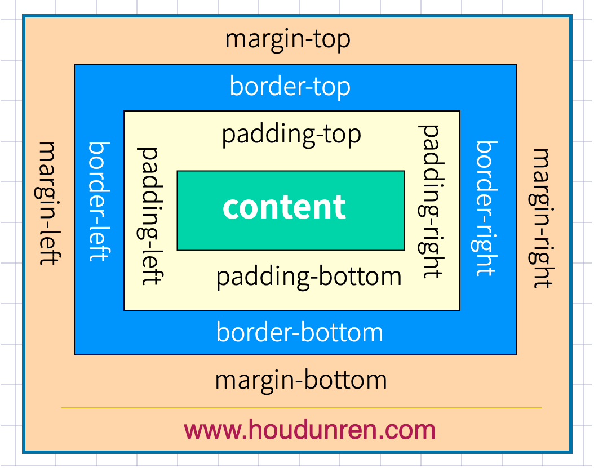

# 盒子模型



## 外边距

### 声明定义

边距顺序依次为：上、右、下、左。

```html
<style>
    main {
        border: solid 1px red;
        width: 500px;
        height: 500px;
        margin: 0 auto;
    }

    h2 {
        border: solid 2px green;
        width: 300px;
        height: 300px;
        margin: 50px 80px 100px 150px;
    }
</style>

<main>
    <h2>source.com</h2>
</main>
```


下例定义上下`50px`边距，左右`80px`边距

```css
 margin: 50px 80px;
```

下面将边距全部定义为 `100px`

```css
margin:100px;
```

### 居中设置

`margin` 设置auto 后，浏览器会自动居中

```html
<style>
    article {
        border: solid 1px red;
    }

    h2,h3 {
        border: solid 10px #ddd;
    }

    h2 {
        width: 300px;
        margin-left: 200px;
        margin-right: 200px;
    }

    h3 {
        width: 500px;
        margin-left: auto;
        margin-right: auto;
    }
</style>

<article>
    <h2>source.com</h2>
    <h3>mdn.com</h3>
</article>
```


### 负值设置

```html
<style>
    main {
        border: solid 1px red;
        width: 300px;
        margin: 0 auto;
    }

    h2 {
        border: solid 2px green;
        margin-left: -50px;
        margin-right: -50px;
        text-align: center;
    }
</style>

<main>
    <h2>source.com</h2>
</main>
```


### 边距合并

相邻元素的纵向外边距会进行合并

```html
<style>
    h2 {
        border: solid 2px green;
        margin-bottom: 20px;
    }

    h3 {
        border: solid 2px green;
        height: 20px;
    }
</style>

<h2>source.com</h2>
<h2>mdn.com</h2>
<h3></h3>
```


## 内边距

内边距使用 `padding` 进行定义，使用语法与 `margin` 相似。

### 基本使用

```html
<style>
    a {
        padding: 10px 30px;
        border: solid 1px #ddd;
        border-radius: 5px;
    }

    a:hover {
        background: rgb(3, 78, 110);
        color: white;
    }
</style>

<a href="">MYSQL</a>
<a href="">CSS</a>
```


## BOX-SIZING

📒 content-box和border box的区别在于：两者的盒子的宽度是否包含表框和内边距

- content-box（默认样式）
- border-box：元素宽度只包括内容

宽度与高度包括内边距与边框`border-box` （200px * 120px）

```html
<style>
    h2 {
        border: solid 10px #ddd;
        height: 60px;
        width: 200px;
        padding:50px;
        box-sizing: content-box;
    }
</style>

<h2>source.com</h2>
```


## 边框设计

### 样式选择

| 类型   | 描述                                                  |
| :----- | :---------------------------------------------------- |
| none   | 定义无边框。                                          |
| dotted | 定义点状边框。在大多数浏览器中呈现为实线。            |
| dashed | 定义虚线。在大多数浏览器中呈现为实线。                |
| solid  | 定义实线。                                            |
| double | 定义双线。双线的宽度等于 border-width 的值。          |
| groove | 定义 3D 凹槽边框。其效果取决于 border-color 的值。    |
| ridge  | 定义 3D 垄状边框。其效果取决于 border-color 的值。    |
| inset  | 定义 3D inset 边框。其效果取决于 border-color 的值。  |
| outset | 定义 3D outset 边框。其效果取决于 border-color 的值。 |

一次定义四个边

```css
h2 {
    border-style: double;
}
```

样式顺序为上、右、下、左，可以分别进行定义

```css
h2 {
    border-style: outset solid dotted double;
    border-width: 8px;
}
```


单独设置一边样式

| 规则                | 说明 |
| ------------------- | ---- |
| border-top-style    | 顶边 |
| border-right-style  | 右边 |
| border-bottom-style | 下边 |
| border-left-style   | 左边 |
| border-style        | 四边 |

```css
h2 {
    border-top-style: double;
    border-width: 8px;
}
```


### 边框宽度

边框可以通过以下规则来设置

| 规则                | 说明 |
| ------------------- | ---- |
| border-top-width    | 顶边 |
| border-right-width  | 右边 |
| border-bottom-width | 下边 |
| border-left-width   | 左边 |
| border-width        | 四边 |

### 边框颜色

| 规则                | 说明 |
| ------------------- | ---- |
| border-top-color    | 顶边 |
| border-right-color  | 右边 |
| border-bottom-color | 下边 |
| border-left-color   | 左边 |
| border-color        | 四边 |

### 简写规则

| 规则          | 说明 |
| ------------- | ---- |
| border-top    | 顶边 |
| border-right  | 右边 |
| border-bottom | 下边 |
| border-left   | 左边 |
| border        | 四边 |

设置底部边框

```css
border-bottom: solid 5px red;
```

### 行元素边框

行元素也可以进行边框设置

```css
em {
    border-bottom: solid 2px red;
}
```

### 圆角边框 👾

使用 `border-radius` 规则设置圆角，可以使用`px | %` 等单位。也支持四个边分别设置。

| 选项                       | 说明 |
| -------------------------- | ---- |
| border-top-left-radius     | 上左 |
| border-top-right-radius    | 上右 |
| border-bottom-left-radius  | 下载 |
| border-bottom-right-radius | 下右 |

```css
h2 {
    border-radius: 10px;
    border: solid 2px red;
}
```

通过边框绘制圆

```css
div {
    width: 100px;
    height: 100px;
    border: solid 3px red;
    border-radius: 50%;
}
```

定义不同边

```css
border-radius: 10px 30px 50px 100px;
```

行元素绘制圆角

```css
em {
	border-radius: 50%;
	border-bottom: solid 2px red;
}
```


## 轮廓线

元素在获取焦点时产生，并且轮廓线不占用空间。可以使用伪类 `:focus` 定义样式。

- 轮廓线显示在边框外面
- 轮廓线不影响页面布局

### 线条样式

| 值     | 描述                                                |
| :----- | :-------------------------------------------------- |
| none   | 默认。定义无轮廓。                                  |
| dotted | 定义点状的轮廓。                                    |
| dashed | 定义虚线轮廓。                                      |
| solid  | 定义实线轮廓。                                      |
| double | 定义双线轮廓。双线的宽度等同于 outline-width 的值。 |
| groove | 定义 3D 凹槽轮廓。此效果取决于 outline-color 值。   |
| ridge  | 定义 3D 凸槽轮廓。此效果取决于 outline-color 值。   |
| inset  | 定义 3D 凹边轮廓。此效果取决于 outline-color 值。   |
| outset | 定义 3D 凸边轮廓。此效果取决于 outline-color 值。   |

```html
<style>
    p {
        border: 1px solid red;
        /* outline: green dotted thick; */
        outline-color: green;
        outline-width: thick;
    }

    p.dotted {
        outline-style: dotted;
    }
    ...
</style>
<p class="dotted">点线轮廓</p>
<p class="dashed">虚线轮廓</p>
<p class="solid">实线轮廓</p>
<p class="double">双线轮廓</p>
<p class="groove">凹槽轮廓</p>
<p class="ridge">垄状轮廓</p>
<p class="inset">嵌入轮廓</p>
<p class="outset">外凸轮廓</p>
```


### 线宽设置

```css
outline-width: 10px;
```

### 线条颜色

```css
outline-color: red;
```

### 组合定义

```css
outline: red solid 2px;
```

### 表单轮廓线 👾

表单默认具有轮廓线，但有时并不好看，使用以下样式规则去除。

```css
input:focus {
	outline: none;
}
```

## DISPLAY

### 控制显示隐藏

使用 `display` 控制元素的显示机制。

| 选项         | 说明                        |
| ------------ | --------------------------- |
| none         | 隐藏元素                    |
| block        | 显示为块元素                |
| inline       | 显示为行元素，不能设置宽/高 |
| inline-block | 行级块元素，允许设置宽/高   |

### 行转块元素

```html
<style>
    a {
        border: solid 1px #ddd;
        display: block;
        margin-bottom: 5px;
    }
</style>

<a href="">source.com</a>
<a href="">source.com</a>
<a href="">source.com</a>
```


### 块转为行元素

```html
<style>
    ul>li {
        display: inline;
        padding: 5px 10px;
        border: solid 1px #ddd;
    }

    ul>li:hover {
        background: green;
        color: white;
        cursor: pointer;
    }
</style>
<ul>
    <li>mdn.com</li>
    <li>source.com</li>
    <li>hello</li>
</ul>
```


### 行级块使用 

将a标签转为`inline-block`之后，可以设置其高度 📌

```html
<style>
    a {
        display: inline-block;
        width: 30%;
        height: 50px;
        border: solid 1px #ddd;
        text-align: center;
        line-height: 3em;
    }
</style>

<a href="">MYSQL</a>
<a href="">LINUX</a>
<a href="">PHP</a>
```


## VISIBILITY

控制元素的显示隐藏，在隐藏后空间位也保留。


```html
<style>
    article {
        padding: 30px;
        border: solid 2px red;
        width: 200px;
    }
    article div {
        width: 100px;
        height: 100px;
        border: solid 2px red;
        padding: 20px;
    }
    article div:nth-of-type(1) {
        visibility: hidden;
    }
</style>

<article>
    <div></div>
    <div></div>
</article>
```


## 溢出控制

### 隐藏控制

| 选项   | 说明                                                 |
| ------ | ---------------------------------------------------- |
| hidden | 溢出内容隐藏                                         |
| scroll | 显示滚动条（有些浏览器会一直显示，有些在滚动时显示） |
| auto   | 根据内容自动处理滚动条                               |

**溢出隐藏**

```css
div {
    width: 400px;
    height: 100px;
    border: solid 2px #ddd;
    padding: 20px;
    overflow: hidden;
}
```


**溢出产生滚动条**

不同浏览器处理方式不同，有些直接显示出来，有些在滚动时才显示。

```css
div {
    width: 400px;
    height: 100px;
    border: solid 2px #ddd;
    padding: 20px;
    overflow: scroll;
}
```


### 文本溢出 👾

**单行文本溢出**

```css
div {
    width: 400px;
    height: 100px;
    border: solid 2px #ddd;
    padding: 20px;
    overflow: hidden;
    text-overflow: ellipsis;
    white-space: nowrap;
}
```


**多行文本溢出控制**

```css
div {
    width: 400px;
    border: solid 2px #ddd;
    overflow: hidden;
    display: -webkit-box;
    -webkit-line-clamp: 3;
    -webkit-box-orient: vertical;
}
```


## 尺寸定义

可以使用多种方式为元素设置宽、高尺寸。

| 选项           | 说明             |
| -------------- | ---------------- |
| width          | 宽度             |
| height         | 高度             |
| min-width      | 最小宽度         |
| min-height     | 最小高度         |
| max-width      | 最大宽度         |
| max-height     | 最大高度         |
| fill-available | 撑满可用的空间   |
| fit-content    | 根据内容适应尺寸 |

### min&max

正文中不希望图片太大造成溢出窗口，也不希望太小影响美观，使用以下代码可以做到约束。

```html
<style>
    div {
        width: 600px;
        border: solid 2px #ddd;
        padding: 20px;
    }
    div img {
        min-width: 50%;
        max-width: 90%;
    }
</style>
```

### fill-available 👾

在`chrome` 浏览器中使用前缀 `-webkit` 书写样式。

下面是行块元素可以撑满可用空间后的效果。


```html
<style>
    * {
        padding: 0;
        margin: 0;
    }

    body {
        width: 100vw;
        height: 100vh;
        background: #2c3e50;
    }

    main {
        background: #9b59b6;
        height: 100px;
        padding: 20px;
        box-sizing: border-box;
    }

    span {
        background: #e67e22;
        display: inline-block;
        width: -webkit-fill-available;
        height: -webkit-fill-available;
    }
</style>

<main>
    <span>
        source.com
    </span>
</main>
```

### fit-content

下面是根据内容自动适应宽度，让元素居中显示的效果。(h2原本作为block元素宽度是100%)


```html
<style>
    * {
        padding: 0;
        margin: 0;
    }

    body {
        width: 100vw;
        height: 100vh;
        background: #2c3e50;
    }

    h2 {
        text-align: center;
        background: #f1c40f;
        width: fit-content;
        margin: auto;
    }
</style>

<h2>source.com</h2>
```

### min-content

使用`min-content` 将容器尺寸按最小元素宽度设置。


```html
<style>
    * {
        padding: 0;
        margin: 0;
    }

    body {
        width: 100vw;
        height: 100vh;
        background: #2c3e50;
    }

    main {
        width: min-content;
        margin: auto;
    }

    div {
        margin-bottom: 20px;
        background: #f1c40f;
        word-break: break-all;
        padding: 10px;
    }

    div:nth-child(1) {
        width: 100px;
    }
</style>


<main>
    <div>source.com</div>
    <div>mdn.com</div>
</main>
```

### max-content

容器尺寸按子元素最大宽度设置。


```html
<style>
    * {
        padding: 0;
        margin: 0;
    }

    body {
        width: 100vw;
        height: 100vh;
        background: #2c3e50;
    }

    main {
        width: max-content;
        margin: auto;
    }

    div {
        margin-bottom: 20px;
        background: #f1c40f;
        word-break: break-all;
        padding: 10px;
    }
</style>

<main>
    <div>source.com</div>
    <div>mdn.com</div>
</main>

```