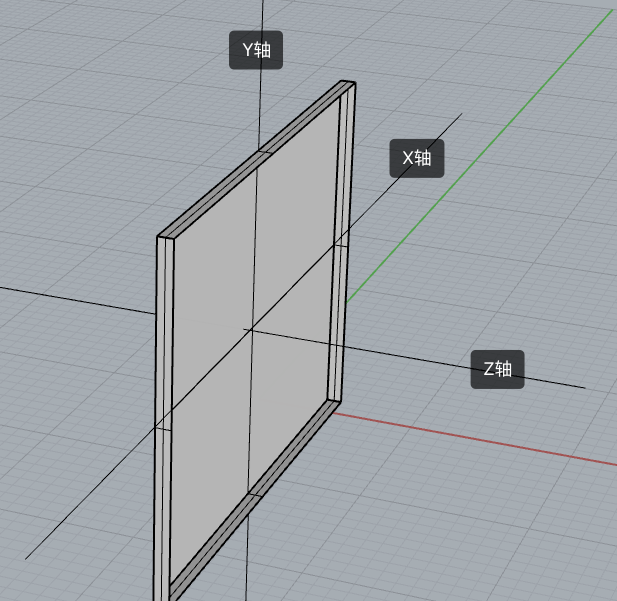
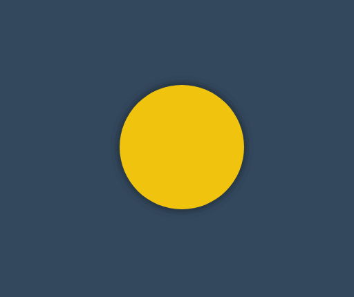

# 变形动画

## 基础知识

### 坐标系统

📗 要使用元素变形操作需要掌握**坐标轴**，然后通过改变不同坐标来控制元素的变形。

👾 *例如在rotate下，我们的视角是 +Z到 -Z，横线为 X, Y为垂直轴*

- X轴是水平轴
- Y轴是垂直轴
- Z轴是纵深轴



### 变形操作

📗 使用 `transform` 规则控制元素的**变形操作**，包括控制移动、旋转、倾斜、3D转换等

下面是CSS提供的变形动作。

| 选项                          | 说明                                  |
| ----------------------------- | ------------------------------------- |
| none                          | 定义不进行转换。                      |
| translate(*x*,*y*)            | 定义 2D 转换。                        |
| translate3d(*x*,*y*,*z*)      | 定义 3D 转换。                        |
| translateX(*x*)               | 定义转换，只是用 X 轴的值。           |
| translateY(*y*)               | 定义转换，只是用 Y 轴的值。           |
| translateZ(*z*)               | 定义 3D 转换，只是用 Z 轴的值。       |
| scale(*x*,*y*)                | 定义 2D 缩放转换。                    |
| scale3d(*x*,*y*,*z*)          | 定义 3D 缩放转换。                    |
| scaleX(*x*)                   | 通过设置 X 轴的值来定义缩放转换。     |
| scaleY(*y*)                   | 通过设置 Y 轴的值来定义缩放转换。     |
| scaleZ(*z*)                   | 通过设置 Z 轴的值来定义 3D 缩放转换。 |
| rotate(*angle*)               | 定义 2D 旋转，在参数中规定角度。      |
| rotate3d(*x*,*y*,*z*,*angle*) | 定义 3D 旋转。                        |
| rotateX(*angle*)              | 定义沿着 X 轴的 3D 旋转。             |
| rotateY(*angle*)              | 定义沿着 Y 轴的 3D 旋转。             |
| rotateZ(*angle*)              | 定义沿着 Z 轴的 3D 旋转。             |
| skew(*x-angle*,*y-angle*)     | 定义沿着 X 和 Y 轴的 2D 倾斜转换。    |
| skewX(*angle*)                | 定义沿着 X 轴的 2D 倾斜转换。         |
| skewY(*angle*)                | 定义沿着 Y 轴的 2D 倾斜转换。         |
| perspective(*n*)              | 为 3D 转换元素定义透视视图。          |

### 变形叠加

📗 ~~重复设置(声明)~~变形操作时只在**原形态**上操作。

#### 默认处理

下面声明了两次移动，并不会移动 550px 而是只移动50px。

```css
div {
    transform: translateX(500px);
    width: 100px;
    height: 100px;
    background: #9b59b6;
}
div:nth-child(1) {
    transform: translateX(50px);
}
```


#### 伪类叠加


```html
<style>
    div {
        transition: 2s;
        /* 相当于translateX(250px) */
        transform: translateX(200px) translateX(50px);
        width: 100px;
        height: 100px;
        background: #9b59b6;
    }

    div:hover {
        transition: 2s;
        /* hover之后从x轴250px位置移动回100px位置 */
        transform: translateX(100px);
    }
</style>

<div></div>
```

### 行级元素

👾 行级元素不产生变形效果，将其转为 `inline-block` 或 `block` 以及弹性元素时都可以产生变化效果。


```html
<style>
    span {
        display: inline-block;
        transition: 2s;
        transform: translateX(100px) translateX(50px);
        width: 100px;
        height: 100px;
        background: #9b59b6;
    }

    span:hover {
        transition: 2s;
        transform: translateX(100px);
    }
</style>

<span></span>
```

## 伪类状态

### :hover

鼠标移动上后发生改变。


```css
article div:nth-child(2):hover {
    transform: rotate(180deg);
}
```

### :target

以下操作变化时间为零秒，通过掌握后面的过渡动画可以控制变化时间。

*当页面链接有#elementId时，对应的element的css伪类:target生效*


```html
<style>
    article {
        width: 200px;
        height: 200px;
        display: grid;
        gap: 10px;
        grid-template-columns: repeat(2, 1fr);
        grid-template-rows: repeat(2, 1fr);
        position: relative;
        border: solid 5px silver;
        color: white;
    }

    article div a {
        color: white;
        text-decoration: none;
    }

    article div,
    article div aside {
        background: blueviolet;
        background-clip: content-box;
        padding: 5px;
        border: solid 2px blueviolet;
        box-sizing: border-box;
        display: flex;
        justify-content: center;
        align-items: center;
        position: relative;
    }

    article div aside {
        position: absolute;
        display: none;
        width: 100px;
        height: 100px;
    }

    aside:target {
        display: block;
        transform: translateY(100px);
        box-shadow: 0 0 10px #ddd;
    }
</style>

<article>
    <div>
        <a href="#a">A</a>
        <aside id="a">
            A
        </aside>
    </div>
    <div>
        <a href="#b">B</a>
        <aside id="b">
            B
        </aside>
    </div>
</article>
```

## 移动元素

- 沿X轴移动时正值向右移动、负值向左移动
- 沿Y轴移动时正值向下移动、负值向上移动
- 如果使用百分数将控制元素的原尺寸计算百分比然后移动 📌
- 可同时设置多个值，解析器会从左向右依次执行
- 变形是在原基础上更改，即第二次设置值时不是在第一次值上变化 (*可以同时设置，但是重复声明不会叠加*)

### translateX

正值向右移动、负值向左移动。


```html
<style>
    article {
        width: 300px;
        height: 300px;
        position: relative;
        border: solid 5px silver;
    }

    article div {
        width: 100px;
        height: 100px;
        background: blueviolet;
        box-sizing: border-box;
        position: absolute;
        left: 50%;
        margin-left: -50px;
        top: 50%;
        margin-top: -50px;
    }

    article div:nth-child(1) {
        background: #e9dddd;
    }

    article div:nth-child(2) {
        transform: translateX(100px);
    }
</style>

<article>
    <div></div>
    <div></div>
</article>
```

### translateY

正值向下移动、负值向上移动。


```css
article div:nth-child(2) {
	transform: translateY(100px);
}
```

### translate

📗 使用 `translate` 可以控制按X、Y同时移动操作，第一个值控制X移动，第二个值控制Y移动。


```css
article div:nth-child(2) {
    transform: translate(100px, -100px);
}
```

### 百分比移动

📗 元素宽度为100px设置50%时将移动50px，即百分比是指**元素的尺寸**的百分比。


```css
article div:nth-child(2) {
	transform: translateX(50%);
}
```

### 元素居中

📗 居中可以使用多种方式，如弹性布局、定位操作，下面是使用移动操作居中。


```html
<style>
    body {
        height: 100vh;
    }

    main {
        width: 400px;
        height: 400px;
        border: solid 5px silver;
        position: relative;
    }

    main div {
        width: 100px;
        height: 100px;
        background: blueviolet;
        position: absolute;
        left: 50%;
        top: 50%;
        transform: translate(-50%, -50%);
    }
</style>

<main>
    <div></div>
</main>
```

### translateZ

📗 控制Z轴移动，正数向外、负数向里移动。因为Z轴是透视轴没有像X/Y一样的固定尺寸，所以**不能使用百分数**。


```html
<style>
    * {
        padding: 0;
        margin: 0;
        box-sizing: border-box;
        list-style: none;
    }

    body {
        width: 100vw;
        height: 100vh;
        background: #34495e;
    }

    main {
        position: absolute;
        left: 50%;
        top: 50%;
        width: 200px;
        height: 200px;
        transform-style: preserve-3d;
        transition: 2s;
        transform: perspective(900px) rotateY(60deg);
    }

    body:hover main {
        transform: perspective(600px) rotateY(60deg) scaleZ(5);
    }

    div {
        position: absolute;
        top: 0;
        left: 0;
        width: 100%;
        height: 100%;
        background: #f1c40f;
    }

    div.b {
        background: #8e44ad;
        transform: translateZ(-100px);
    }
</style>

<main>
    <div class="f"></div>
    <div class="b"></div>
</main>
```

### translate3d

📗 用于同时控制X/Y/Z轴的移动，三个值必须输入如果某个轴不需要移动时设置为零。


```html
<style>
    * {
        padding: 0;
        margin: 0;
        box-sizing: border-box;
        list-style: none;
    }

    body {
        width: 100vw;
        height: 100vh;
        background: #34495e;
    }

    main {
        position: absolute;
        left: 50%;
        top: 50%;
        width: 200px;
        height: 200px;
        background: #f1c40f;
        perspective: 600px;
        transform: perspective(600px) rotateY(35deg);
        transition: 2s;
    }

    body:hover main {
        transform: perspective(600px) rotateY(35deg) translate3d(50%, 50%, 200px);
    }
</style>

<main>
    <div></div>
</main>
```

### 渐变表单


```html
<style>
    * {
        margin: 0;
        padding: 0;
    }

    body {
        background-color: #34495e;
    }

    main {
        margin: 200px auto;
        width: fit-content;
    }

    .field {
        margin-bottom: 12px;
        position: relative;
        overflow: hidden;
        background-color: #ecf0f1;
    }

    .field::before {
        content: "";
        position: absolute;
        background: linear-gradient(to right, #fff, #7f8c8d, #e74c3c, #f1c40f, #1abc9c, #fff);
        bottom: 0;
        height: 1px;
        left: 0;
        right: 0;
        transition: 2s;
        transform: translateX(-100%);
    }

    .field:hover::before {
        transform: translateX(100%);
    }

    .field input {
        border: 0;
        height: 32px;
        font-size: 18px;
        line-height: 30px;
        padding: 6px;
        outline: none;
    }
</style>

<main>
    <div class="field">
        <input type="text"></input>
    </div>
	<div class="field">
    	<input type="text"></input>
	</div>
</main>
```

### 页面切换 💡

下面是使用移动效果制作的页面切换效果。


```html
<link rel="stylesheet" href="https://maxcdn.bootstrapcdn.com/font-awesome/4.7.0/css/font-awesome.min.css">
<style>
    * {
        padding: 0;
        margin: 0;
    }

    a {
        text-decoration: none;
    }

    body {
        display: flex;
        width: 100vw;
        height: 100vh;
        flex-direction: column;
    }

    main {
        position: relative;
        background: #f3f3f3;
        flex: 1;
        overflow: hidden;
    }

    nav {
        display: flex;
        justify-content: space-around;
        align-items: center;
        height: 8vh;
        text-align: center;
        background: #34495e;
    }

    nav a {
        flex: 1;
        font-size: 1.3em;
        text-transform: uppercase;
        font-weight: bold;
        opacity: .8;
        color: white;
    }

    nav a:nth-child(2) {
        border-right: solid 1px #aaa;
        border-left: solid 1px #aaa;
    }

    main>div {
        position: absolute;
        left: 0;
        top: 0;
        width: 100%;
        height: 100%;
        transition: all 1s;
        z-index: 1;
        background: #f3f3f3;
        opacity: 0;
        display: flex;
        flex-direction: column;
        justify-content: center;
        align-items: center;
        transform: translate(0, -100%);
        color: white;
        font-size: 2em;
    }

    /* target时将透明度转化为1,将卡片移动到页面原始位置 */
    main>div:target {
        opacity: 1;
        transform: translate(0%, 0%);
    }

    main>div:nth-of-type(1):target {
        background: #3498db;
    }

    main>div:nth-of-type(2):target {
        background: #9b59b6;
    }

    main>div:nth-of-type(3):target {
        background: #16a085;
    }

    div i[class^="fa"] {
        font-size: 100px;
        color: white;
    }
</style>

<body>
    <main>
        <div id="home">
            <i class="fa fa-home" aria-hidden="true"></i>
            Jerry Chen
        </div>
        <div id="video">
            <i class="fa fa-vimeo" aria-hidden="true"></i>
        </div>
        <div id="live">
            <i class="fa fa-viadeo" aria-hidden="true"></i>
        </div>
    </main>
    <nav>
        <a href="#home">home</a>
        <a href="#video">video</a>
        <a href="#live">live</a>
    </nav>
</body>
```

## 缩放元素

比如数值为2时表示为原尺寸的两倍。

### scaleX

下面是沿X轴缩放一半。（缩放指的是轴的缩放，不是元素的缩放📌）


```css
article div:nth-child(2) {
	transform: scaleX(.5);
}
```

### scaleY

下面是沿Y轴缩放一半。


```css
article div:nth-child(2) {
	transform: scaleY(.5);
}
```

### scale

使用 `scale` 可同时设置 `X/Y` 轴的缩放，如果只设置一个值时表示两轴缩放相同。

使用数值定义缩放，如 .5 表示缩小一半，2 表示放大两倍。


```css
article div:nth-child(2) {
	transform: scale(.5, 2);
}
```

### scaleZ

沿Z轴缩放元素，需要有3D透视才可以查看到效果。


```html
<style>
    * {
        padding: 0;
        margin: 0;
        box-sizing: border-box;
    }

    body {
        width: 100vw;
        height: 100vh;
    }

    main {
        position: absolute;
        left: 50%;
        top: 50%;
        transform: translate(-50%, -50%);
        width: 400px;
        height: 400px;
        border: solid 5px silver;
        transform-style: preserve-3d;
        transform: perspective(900px) rotateY(45deg);
        transition: 3s;
    }

    div {
        position: absolute;
        left: 50%;
        top: 50%;
        margin-left: -100px;
        margin-top: -100px;
        width: 200px;
        height: 200px;
    }

    div:nth-child(1) {
        background: #2ecc71;
    }

    div:nth-child(2) {
        background: #e67e22;
        transition: 1s;
        transform: translateZ(-300px);
    }

    body:hover main {
        /* Z轴放大3倍实现距离拉长 */
        transform: perspective(900px) rotateY(45deg) scaleZ(3);
    }
</style>

<main>
    <div></div>
    <div></div>
</main>
```

### scale3d

沿X/Y/Z三个轴绽放元素。


```html
<style>
    * {
        padding: 0;
        margin: 0;
        box-sizing: border-box;
        list-style: none;
    }

    body {
        width: 100vw;
        height: 100vh;
        background: #34495e;
    }

    main {
        position: absolute;
        left: 50%;
        top: 50%;
        width: 200px;
        height: 200px;
        transform-style: preserve-3d;
        transition: 2s;
        transform: perspective(900px) rotateY(60deg)
    }

    body:hover main {
        transform: perspective(600px) rotateY(60deg) scale3d(2, 2, 4);
    }

    div {
        position: absolute;
        top: 0;
        left: 0;
        width: 100%;
        height: 100%;
        background: #f1c40f;
    }

    div.b {
        background: #8e44ad;
        transform: translateZ(-100px);
    }
</style>

<main>
    <div class="f"></div>
    <div class="b"></div>
</main>
```

### 菜单缩放


```html
<style>
    * {
        padding: 0;
        margin: 0;
    }

    body {
        background: #34495e;
    }

    main {
        position: absolute;
        left: 50%;
        top: 50%;
        transform: translate(-50%, -50%);
    }

    ul {
        list-style: none;
        display: flex;
        justify-content: space-evenly;
        width: 200px;
    }

    ul li {
        position: relative;
    }

    ul li strong {
        background: #e67e22;
        color: #2c3e50;
        padding: 2px 20px;
        cursor: pointer;
        text-transform: uppercase;
    }

    ul li strong+div {
        border: solid 2px #e67e22;
        display: flex;
        flex-direction: column;
        padding: 10px 20px;
        position: absolute;
        /* 设置缩放为0即不显示，设置放缩的原点 */
        transform-origin: left top;
        transform: scale(0);
        z-index: -1;
        transition: .6s;
        background: #e67e22;
    }

    ul li strong+div a {
        display: inline-block;
        padding: 5px;
        font-size: 1em;
        color: #2c3e50;
        text-decoration: none;
        text-transform: uppercase;
    }

    ul li:hover strong+div {
        transform: scale(1);
    }
</style>

<main>
    <ul>
        <li>
            <strong>one</strong>
            <div>
                <a href="">- 1</a>
                <a href="">- 2</a>
                <a href="">- 3</a>
            </div>
        </li>
        <li>
            <strong>two</strong>
            <div>
                <a href="">- 4</a>
                <a href="">- 5</a>
                <a href="">- 6</a>
            </div>
        </li>
    </ul>
</main>
```

### 相册放大 💡

下面是使用缩放开发相册放大效果的示例。


```html
<style>
    body {
        display: flex;
        justify-content: center;
        align-items: center;
        height: 100vh;
        background: #ddd;
    }

    main {
        display: flex;
        justify-content: center;
        align-items: center;
    }

    main div {
        height: 200px;
        width: 200px;
        background: white;
        border: solid 1px #ddd;
        transition: all .5s;
        display: flex;
        justify-content: center;
        align-items: center;
        font-size: 1.5em;
        text-transform: uppercase;
        color: blueviolet;
        overflow: hidden;
        border: solid 3px #555;
        box-sizing: border-box;
    }

    main div img {
        height: 100%;
    }

    main:hover div {
        /* main hover时将所有的div缩放，并设置一个模糊值 */
        transform: scale(.8) translateY(-30px);
        cursor: pointer;
        filter: blur(15px);
    }

    main div:hover {
        transform: scale(1.6);
        color: white;
        filter: none;
        z-index: 2;
    }

    main div:hover::after {
        content: '';
        position: absolute;
        background: #000;
        width: 100%;
        height: 100%;
        z-index: -1;
        box-shadow: 0 0 5px rgba(0, 0, 0, .3);
    }
</style>

<main>
    <div></div>
    <div></div>
    <div></div>
</main>
```

## 旋转操作

使用CSS可以控制**元素**按照不同坐标轴进行旋转。

### rotateX

控制元素按照X轴进行旋转操作。

### 基本使用

按水平轴发生旋转，如果旋转90deg 将不可见。

```text
article div:nth-child(2) {
    transform: rotateX(180deg);
}
```

下面是旋转89deg后，只会看到一条线。


#### 父级透视

当X旋转90度后无法看到元素，这时可以控制父级旋转从上看子元素。


```html
<style>
    * {
        padding: 0;
        margin: 0;
        box-sizing: border-box;
    }

    main {
        position: absolute;
        left: 50%;
        top: 50%;
        margin-left: -200px;
        margin-top: -200px;
        width: 400px;
        height: 400px;
        border: solid 5px silver;
        transform-style: preserve-3d;
        transform: perspective(900px) rotateX(-45deg);
    }

    div {
        position: absolute;
        left: 50%;
        top: 50%;
        margin-left: -100px;
        margin-top: -100px;
        width: 200px;
        height: 200px;
        transition: 1s;
    }

    div:nth-child(1) {
        background: #2ecc71;
    }

    main:hover div:nth-child(1) {
        transform: perspective(900px) rotateX(90deg) rotateY(25deg) rotateZ(45deg);
    }
</style>

<main>
    <div></div>
</main>
```

### rotateY

按垂直轴旋转，如果旋转90deg 将不可见。

```css
article div:nth-child(2) {
    transform: rotateY(180deg);
}
```

### rotateZ

没Z轴旋转元素，效果就是沿X/Y轴的平面旋转。


```html
<style>
    * {
        padding: 0;
        margin: 0;
        box-sizing: border-box;
        list-style: none;
    }

    body {
        width: 100vw;
        height: 100vh;
        background: #34495e;
    }

    main {
        position: absolute;
        left: 50%;
        top: 50%;
        width: 200px;
        height: 200px;
        background: #f1c40f;
        perspective: 600px;
        transform: perspective(600px) rotateY(35deg);
        transition: 2s;
    }

    body:hover main {
        transform: perspective(600px) rotateY(35deg) rotateZ(160deg);
    }
</style>

<main>
    <div></div>
</main>
```

### rotate

在X与Y轴**平面**旋转，效果与使用 `rotateZ` 相同。

```css
article div:nth-child(2) {
	transform: rotate(45deg); /* Equal to rotateZ(45deg) */
}
```

### rotate3d

同时设置X/Y/Z轴的旋转向量值来控制元素的旋转。

需要同时设置如下四个参数

```css
rotate3d(tx,ty,tz,angle)
```

#### 只转X轴


```html
<style>
    * {
        padding: 0;
        margin: 0;
        box-sizing: border-box;
        list-style: none;
    }

    body {
        width: 100vw;
        height: 100vh;
        background: #34495e;
    }

    main {
        position: absolute;
        left: 50%;
        top: 50%;
        width: 200px;
        height: 200px;
        background: #f1c40f;
        perspective: 600px;
        transform: perspective(600px) rotateY(35deg);
        transition: 2s;
    }

    body:hover main {
        transform: perspective(600px) rotateY(35deg) rotate3d(1, 0, 0, -645deg);
    }
</style>

<main>
    <div></div>
</main>
```

#### 只转Y轴


```css
body:hover main {
	transform: perspective(600px) rotateY(-645deg);
}
```

#### 只转Z轴


#### XY旋转


```css
body:hover main {
	transform: perspective(600px) rotateY(35deg) rotate3d(1, 1, 0, -645deg);
}
```

#### XZ转换

加入适当的Z向量值，可增加元素沿Z轴旋转的力度。


```css
body:hover main {
	transform: perspective(600px) rotateY(35deg) rotate3d(1, 0, .5, -245deg);
}
```

### 参数顺序

可以同时设置多个旋转规则，顺序不同结果也会不同。(参考**矩阵的乘法**，顺序不同结果也不同)


```css
article div:nth-child(2) {
	transform: rotateX(30deg) rotateY(30deg);
}
```

### 旋转文字


```html
<style>
    * {
        padding: 0;
        margin: 0;
    }

    body {
        height: 100vh;
        display: flex;
        flex-direction: column;
        justify-content: center;
        align-items: center;
    }

    main {
        margin: 0 auto;
        width: 400px;
        height: 50vh;
        display: flex;
        flex-direction: column;
        justify-content: center;
        align-items: center;
        background: #535c68;
    }

    main div {
        color: #c7ecee;
        cursor: pointer;
    }

    main div strong {
        display: inline-block;
        width: 25px;
        height: 25px;
        margin: 0 3px;
        background: #000;
        border-radius: 50%;
        transition: 2s;
        color: white;
        text-align: center;
        box-shadow: 0 2px 10px rgba(0, 0, 0, .3);
    }

    main div strong:nth-of-type(1) {
        background: #f0932b;
    }

    main div strong:nth-of-type(2) {
        background: #6ab04c;
    }

    main div:hover strong:nth-of-type(1) {
        transform: rotate(360deg);
    }

    main div:hover strong:nth-of-type(2) {
        transform: rotate(-360deg);
    }
</style>

<main>
    <div>
        <strong>J</strong>erry<strong>C</strong>hen
    </div>
</main>
```

### 电子时钟 🕒


```html
<style>
    body {
        display: flex;
        justify-content: center;
        align-items: center;
        height: 100vh;
        background: #34495e;
    }

    main {
        position: relative;
        width: 400px;
        height: 400px;
        background: #34495e;
        border-radius: 50%;
        box-shadow: 0 0 10px rgba(0, 0, 0, .7);
    }

    main::before {
        position: absolute;
        left: 0;
        top: 0;
        content: '';
        width: 100%;
        height: 100%;
        border-radius: 50%;
        transform: scale(1.2);
        background: radial-gradient(at right, #27ae60, #e67e22, #e74c3c, #e67e22, #27ae60);
        z-index: -1;
    }

    main .line>div {
        position: absolute;
        left: 50%;
        top: 50%;
        width: 10px;
        height: 95%;
        background: white;
    }

    main .line>div:nth-child(1) {
        transform: translate(-50%, -50%) rotate(0deg);
    }

    main .line>div:nth-child(2) {
        transform: translate(-50%, -50%) rotate(30deg);
    }

    main .line>div:nth-child(3) {
        transform: translate(-50%, -50%) rotate(60deg);
    }

    main .line>div:nth-child(4) {
        transform: translate(-50%, -50%) rotate(90deg);
    }

    main .line>div:nth-child(5) {
        transform: translate(-50%, -50%) rotate(120deg);
    }

    main .line>div:nth-child(6) {
        transform: translate(-50%, -50%) rotate(150deg);
    }

    main>div[class="mark"] {
        position: absolute;
        width: 100%;
        height: 100%;
        left: 0%;
        top: 0%;
        background: #34495e;
        border-radius: 50%;
        transform: scale(.8);
    }

    main>.point {
        width: 20px;
        height: 20px;
        background: #e74c3c;
        border-radius: 50%;
        position: absolute;
        top: 50%;
        left: 50%;
        transform: translate(-50%, -50%);
        z-index: 2;
    }

    main .hour {
        width: 15px;
        position: absolute;
        height: 25%;
        background: #95a5a6;
        left: 50%;
        bottom: 50%;
        transform: translate(-50%, 0);
    }

    main .minute {
        width: 8px;
        position: absolute;
        height: 35%;
        background: #3498db;
        left: 50%;
        bottom: 50%;
        transform-origin: left bottom;
        transform: translate(-50%, 0) rotate(60deg);
    }

    main .second {
        width: 2px;
        position: absolute;
        height: 35%;
        background: #f1c40f;
        left: 50%;
        bottom: 50%;
        transform-origin: left bottom;
        transform: translate(-50%, 0) rotate(90deg);
    }

    main:hover .second {
        transition: 10s;
        transform: rotate(260deg);
    }

    main .text {
        font-size: 1.2em;
        color: white;
        position: absolute;
        top: 50%;
        left: 50%;
        transform: translate(-50%, 20px);
        text-transform: uppercase;
        opacity: .5;
        text-align: center;
    }
</style>

<main>
    <section class="line">
        <div></div>
        <div></div>
        <div></div>
        <div></div>
        <div></div>
        <div></div>
    </section>
    <div class="mark"></div>
    <div class="point"></div>
    <div class="hour"></div>
    <div class="minute"></div>
    <div class="second"></div>
    <div class="text">
        blog.caffreygo.com <br>
        乌拉拉
    </div>
</main>
```

## 倾斜操作

> skew: 歪斜

### skewX

没X轴倾斜元素


```css
article div:nth-child(2) {
	transform: skewX(30deg);
}
```

### skewY

沿Y轴倾斜元素


```css
article div:nth-child(2) {
	transform: skewY(30deg);
}
```

### skew

同时设置X/Y轴倾斜操作，不指定第二个参数时Y轴倾斜为零。


```css
article div:nth-child(2) {
	transform: skew(30deg, 30deg);
}
```

### 按钮特效 💡

Y轴不倾斜，上下保持水平；X轴倾斜，左右出现斜边。


```html
<style>
    * {
        padding: 0;
        margin: 0;
    }

    body {
        background: #34495e;
    }

    main {
        /* 绝对定位+移动 实现居中 */
        position: absolute;
        left: 50%;
        top: 50%;
        transform: translate(-50%, -50%);
    }

    main .btn {
        display: block;
        height: 30px;
        width: 150px;
        border: solid 2px #e74c3c;
        background: none;
        color: white;
        position: relative;
        text-align: center;
        display: flex;
        justify-content: center;
        align-items: center;
        overflow: hidden;
        cursor: pointer;
        box-shadow: 0 3px 8px rgba(0, 0, 0, .3);
    }

    main .btn::before {
        transition: all .8s;
        align-self: center;
        content: '';
        position: absolute;
        width: 0;
        height: 100%;
        background: #e74c3c;
        z-index: -1;
        transform: skewX(-45deg);
    }

    main .btn:hover::before {
        width: 200%;
    }
</style>

<main>
    <a class="btn">
        JERRYCHEN
    </a>
</main>
```

### 立体按钮 👾


```html
<style>
    * {
        padding: 0;
        margin: 0;
        box-sizing: border-box;
    }

    body {
        background: #2c3e50;
        width: 100vw;
        height: 100vh;
        display: flex;
        justify-content: center;
        align-items: center;
    }

    .btn {
        color: #ecf0f1;
        text-decoration: none;
        width: 200px;
        height: 40px;
        background: #e74c3c;
        display: flex;
        justify-content: center;
        align-items: center;
        position: relative;
        transform: skewX(25deg) rotate(-15deg);
        letter-spacing: .5em;
        text-transform: uppercase;
        font-weight: bold;
    }

    .btn::before {
        /* 上下边倾斜，skewY */
        content: '';
        width: 10px;
        height: 100%;
        left: -10px;
        background: #000;
        position: absolute;
        transform: skewY(-45deg) translate(0, 5px);
    }

    .btn::after {
        /* 左右边倾斜，skewX */
        content: '';
        width: 100%;
        height: 10px;
        bottom: -10px;
        background: #000;
        position: absolute;
        transform: skewX(-45deg) translate(-5px, 0);
    }
</style>

<a href="" class="btn">JerryChen</a>
```

## 变形基点

使用 `transform-origin` 设置元素的X/YZ操作的基点，用于控制旋转、倾斜等操作。

::: tip transfrom-origin

- 旋转默认以**元素中心**进行旋转，改变基点后可控制旋转点位置
- 元素移动不受变形基点所影响
- 基点是元素原始空间位，而不是translate移动后的空间位

::: 

### 平面旋转


```html
<style>
    * {
        padding: 0;
        margin: 0;
        box-sizing: border-box;
    }

    main {
        position: absolute;
        left: 50%;
        top: 50%;
        margin-left: -200px;
        margin-top: -200px;
        width: 400px;
        height: 400px;
        border: solid 5px silver;
    }

    div {
        position: absolute;
        left: 50%;
        top: 50%;
        margin-left: -100px;
        margin-top: -100px;
        width: 200px;
        height: 200px;
        /* 默认是 center center 元素绕中心旋转 */
        transform-origin: right bottom;
    }

    div:nth-child(1) {
        background: #2ecc71;
    }

    div:nth-child(2) {
        background: #e67e22;
        transition: 1s;
    }

    main:hover div:nth-child(2) {
        transform: rotate(-45deg);
    }
</style>

<main>
    <div></div>
    <div></div>
</main>
```

### 倾斜控制

参考右上角控制倾斜。


```html
<style>
    * {
        padding: 0;
        margin: 0;
        box-sizing: border-box;
    }

    main {
        position: absolute;
        left: 50%;
        top: 50%;
        margin-left: -200px;
        margin-top: -200px;
        width: 400px;
        height: 400px;
        border: solid 5px silver;
    }

    div {
        position: absolute;
        left: 50%;
        top: 50%;
        margin-left: -100px;
        margin-top: -100px;
        width: 200px;
        height: 200px;
        transform-origin: top left;
    }

    div:nth-child(1) {
        background: #fff;
    }

    div:nth-child(2) {
        background: #e67e22;
        transition: 1s;
    }

    main:hover div:nth-child(2) {
        transform: skew(45deg);
    }
</style>

<main>
    <div></div>
    <div></div>
</main>
```

### 三维旋转


```html
<style>
    * {
        padding: 0;
        margin: 0;
        box-sizing: border-box;
    }

    main {
        position: absolute;
        left: 50%;
        top: 50%;
        margin-left: -200px;
        margin-top: -200px;
        width: 400px;
        height: 400px;
        border: solid 5px silver;
        transform-style: preserve-3d;
        transform: perspective(900px) rotateY(95deg);
    }

    div {
        position: absolute;
        left: 50%;
        top: 50%;
        margin-left: -100px;
        margin-top: -100px;
        width: 200px;
        height: 200px;
        transform-origin: center center 200px;
    }

    div:nth-child(1) {
        background: #2ecc71;
    }

    div:nth-child(2) {
        background: #e67e22;
        transition: 1s;
    }

    main:hover div:nth-child(2) {
        transform: rotateY(360deg);
    }
</style>

<main>
    <div></div>
    <div></div>
</main>
```

### 变形顺序的影响

设置transform变形的前后顺序对变形结果是有影响

下面先写rotate 后写translate，即先按原位置的 `transform-origin: top left` 进行旋转，再按原位置的`transform-origin: top left`进行移动


```html
<style>
    body {
        width: 100vw;
        height: 100vh;
        display: flex;
        justify-content: center;
        align-items: center;
    }
    article {
        width: 200px;
        height: 200px;
        border: solid 2px #ddd;
        position: relative;
        background: #34495e;
    }
    article div {
        width: 5px;
        height: 100px;
        background: #000;
        transition: 2s;
        position: absolute;
        transform-origin: top left;
        transform: rotate(0deg) translate(-50%, -50%);
        background-color: #f1c40f;
    }
    article::after {
        content: 'hello world';
        width: 100%;
        color: #f3f3f3;
        font-size: 12px;
        position: absolute;
        bottom: 5px;
        text-align: center;
    }
    article:hover div {
        transform: rotate(360deg) translate(-50%, -50%);
    }
</style>

<article>
    <div></div>
</article>
```

现在交换 `rotate` 与 `translate`的顺序后，表示先移动元素，这时候旋转就是参考移动后的位置的 `transform-origin: top left;`结果如下


```html
<style>
  body {
    width: 100vw;
    height: 100vh;
    display: flex;
    justify-content: center;
    align-items: center;
  }
  article {
    width: 200px;
    height: 200px;
    border: solid 2px #ddd;
    position: relative;
    background: #34495e;
  }
  article div {
    width: 5px;
    height: 100px;
    background: #000;
    transition: 2s;
    position: absolute;
    transform-origin: top left;
    transform: translate(-50%, -50%) rotate(0deg);
    background-color: #f1c40f;
  }
  article::after {
    content: 'hello world';
    width: 100%;
    color: #f3f3f3;
    font-size: 12px;
    position: absolute;
    bottom: 5px;
    text-align: center;
  }
  article:hover div {
    transform: translate(-50%, -50%) rotate(360deg);
  }
</style>

<article>
  <div></div>
</article>
```

### 新年贺卡 💡

下面是通过设置基点来制作贺卡的效果。


```html
<style>
    * {
        padding: 0;
        margin: 0;
        box-sizing: border-box;
    }

    body {
        width: 100vw;
        height: 100vh;
        background: #34495e;
        display: flex;
        justify-content: center;
        align-items: center;
    }

    main {
        width: 300px;
        height: 200px;
    }

    .card {
        width: 300px;
        height: 200px;
        background: #e67e22;
        display: flex;
        justify-content: center;
        align-items: center;
        font-size: 3em;
        color: whitesmoke;
        position: relative;
        transform-style: preserve-3d;
        transform: perspective(900px) rotateX(35deg) rotateY(15deg);
    }

    .card::before,
    .card::after {
        transition: 1s;
        background: #e74c3c;
        line-height: 4em;
    }

    .card::before {
        content: '新年';
        width: 150px;
        height: 100%;
        left: 0px;
        top: 0;
        text-align: right;
        position: absolute;
        transform-origin: left;
    }

    .card::after {
        content: '快乐';
        width: 150px;
        height: 100%;
        left: 150px;
        top: 0;
        position: absolute;
        transform-origin: right;
    }

    .card:hover::before {
        transform: rotateY(-120deg);
    }

    .card:hover::after {
        transform: rotateY(120deg);
    }
</style>


<main>
    <div class="card">恭喜发财</div>
</main>
```

### 动感菜单 👾

为了让大家清楚理解，下面把思路给大家解析一下。


#### 父级有宽度

设置父级ul有宽度，每层都是居中对齐。


```html
<style>
    * {
        padding: 0;
        margin: 0;
        list-style: none;
    }

    body {
        width: 100vw;
        height: 100vh;
        background: #2c3e50;
        display: flex;
        justify-content: center;
        align-items: center;
    }

    nav {
        width: 400px;
        height: 400px;
        background: transparent;
        display: flex;
        justify-content: center;
        align-items: center;
        position: relative;

    }

    nav::after {
        content: 'Menu';
        color: #ecf0f1;
        position: absolute;
        display: flex;
        justify-content: center;
        align-items: center;
        font-size: 2em;
        font-weight: bold;
        text-shadow: 3px 3px 0px #34495e;
        z-index: 1;
    }

    nav::before {
        content: '';
        width: 200px;
        height: 200px;
        background: #e74c3c;
        border-radius: 50%;
        position: absolute;
        left: 50%;
        top: 50%;
        transform: translate(-50%, -50%);
        z-index: 1;
    }

    nav:hover ul {
        transform: scale(1);
    }

    ul {
        width: 300px;
        height: 300px;
        transform: scale(0);
        transition: .5s;
    }

    ul li {
        width: 80px;
        height: 80px;
        background: #e74c3c;
        border-radius: 50%;
        position: absolute;
        display: flex;
        justify-content: center;
        align-items: center;
        font-size: 2.5em;
        color: white;
        transition: 1s;
        transform-origin: 150px 150px;
        box-shadow: 0 0 15px rgba(0, 0, 0.8);
    }

    ul li span {
        transition: 1s;
    }

    nav:hover li:nth-child(1) {
        transform: rotate(40deg);
    }

    nav:hover li:nth-child(1)>span {
        transform: rotate(-40deg);
    }

    nav:hover li:nth-child(2) {
        transform: rotate(80deg);
    }

    nav:hover li:nth-child(2)>span {
        transform: rotate(-80deg);
    }

    nav:hover li:nth-child(3) {
        transform: rotate(120deg);
    }

    nav:hover li:nth-child(3)>span {
        transform: rotate(-120deg);
    }

    nav:hover li:nth-child(4) {
        transform: rotate(160deg);
    }

    nav:hover li:nth-child(4)>span {
        transform: rotate(-160deg);
    }

    nav:hover li:nth-child(5) {
        transform: rotate(200deg);
    }

    nav:hover li:nth-child(5)>span {
        transform: rotate(-200deg);
    }

    nav:hover li:nth-child(6) {
        transform: rotate(240deg);
    }

    nav:hover li:nth-child(6)>span {
        transform: rotate(-240deg);
    }

    nav:hover li:nth-child(7) {
        transform: rotate(280deg);
    }

    nav:hover li:nth-child(7)>span {
        transform: rotate(-280deg);
    }

    nav:hover li:nth-child(8) {
        transform: rotate(320deg);
    }

    nav:hover li:nth-child(8)>span {
        transform: rotate(-320deg);
    }

    nav:hover li:nth-child(9) {
        transform: rotate(360deg);
    }

    nav:hover li:nth-child(9)>span {
        transform: rotate(-360deg);
    }
</style>

<nav>
    <ul>
        <li><span>1</span></li>
        <li><span>2</span></li>
        <li><span>3</span></li>
        <li><span>4</span></li>
        <li><span>5</span></li>
        <li><span>6</span></li>
        <li><span>7</span></li>
        <li><span>8</span></li>
        <li><span>9</span></li>
    </ul>
</nav>
```

#### 父级无宽度

下面代码父级 UL 没有设置宽度，而是使用边框撑开了空间的效果，基本原理和上面一样。



```html
<style>
    * {
        padding: 0;
        margin: 0;
        box-sizing: border-box;
        list-style: none;
    }

    body {
        background: #34495e;
    }

    nav {
        position: absolute;
        margin: 0 auto;
        left: 50%;
        top: 50%;
        width: 180px;
        height: 180px;
        background: #34495e;
        border-radius: 50%;
        text-align: center;
        line-height: 180px;
        color: #2c3e50;
        font-weight: bold;
        font-size: 2em;
        background: #f1c40f;
        box-shadow: 0 0 15px rgba(0, 0, 0, .5);
        cursor: pointer;
        display: flex;
        justify-content: center;
        align-items: center;
    }

    nav strong {
        position: absolute;
    }

    nav:hover ul {
        transform: scale(1.3);
    }

    ul {
        transform: scale(0);
        border: 150px solid transparent;
        transition: .5s;
        cursor: pointer;
        z-index: -1;
    }

    ul li {
        position: absolute;
        top: -100px;
        left: -100px;
        width: 50px;
        height: 50px;
        background: #e67e22;
        border-radius: 50%;
        display: flex;
        justify-content: center;
        align-content: center;
        line-height: 1.5em;
        transition: all 1s;
        transform-origin: 100px 100px;
        box-shadow: 0 0 15px rgba(0, 0, 0, .8);
    }

    ul li span {
        transition: all 1s;
    }

    nav:hover ul li:nth-child(1) {
        transform: rotate(40deg);
    }

    nav:hover ul li:nth-child(1) span {
        transform: rotate(1040deg);
    }

    nav:hover ul li:nth-child(2) {
        transform: rotate(80deg);
    }

    nav:hover ul li:nth-child(2) span {
        transform: rotate(1000deg);
    }

    nav:hover ul li:nth-child(3) {
        transform: rotate(120deg);
    }

    nav:hover ul li:nth-child(3) span {
        transform: rotate(1680deg);
    }

    nav:hover ul li:nth-child(4) {
        transform: rotate(160deg);
    }

    nav:hover ul li:nth-child(4) span {
        transform: rotate(560deg);
    }

    nav:hover ul li:nth-child(5) {
        transform: rotate(200deg);
    }

    nav:hover ul li:nth-child(5) span {
        transform: rotate(520deg);
    }

    nav:hover ul li:nth-child(6) {
        transform: rotate(240deg);
    }

    nav:hover ul li:nth-child(6) span {
        transform: rotate(480deg);
    }

    nav:hover ul li:nth-child(7) {
        transform: rotate(280deg);
    }

    nav:hover ul li:nth-child(7) span {
        transform: rotate(440deg);
    }

    nav:hover ul li:nth-child(8) {
        transform: rotate(320deg);
    }

    nav:hover ul li:nth-child(8) span {
        transform: rotate(400deg);
    }

    nav:hover ul li:nth-child(9) {
        transform: rotate(360deg);
    }

    nav:hover ul li:nth-child(9) span {
        transform: rotate(720deg);
    }
</style>

<nav>
    <ul>
        <li><span>1</span></li>
        <li><span>2</span></li>
        <li><span>3</span></li>
        <li><span>4</span></li>
        <li><span>5</span></li>
        <li><span>6</span></li>
        <li><span>7</span></li>
        <li><span>8</span></li>
        <li><span>9</span></li>
    </ul>
</nav>
```

## 透视景深

### perspective

- 使用 `perspective` 来控制元素的透视景深
- `perspective` 规则为舞台元素控制景深， `perspective` 属性为控制单个元素

### 舞台透视

`perspective` 规则用于将父级整个做为透视元素，会造成里面的每个子元素的透视是不一样的。就像现实中摆一排杯子，是使用统一透视的，每个杯子的透视不一样，造成有大有小。


```html
<style>
    article {
        margin: 0 auto;
        margin-top: 150px;
        width: 400px;
        height: 200px;
        position: relative;
        border: solid 5px silver;
        perspective: 200px;
    }

    article div {
        width: 100px;
        height: 100px;
        background: blueviolet;
        box-sizing: border-box;
        margin-right: 80px;
        float: left;
        transform: rotateY(60deg);
    }
</style>

<article>
    <div></div>
    <div></div>
</article>
```

### 单独透视

`perspective` 函数用于为元素设置单独透视，下面是为元素单独设置透视参数，每个元素的透视效果是一样的。


```css
article div {
    width: 100px;
    height: 100px;
    background: blueviolet;
    box-sizing: border-box;
    margin-right: 80px;
    float: left;
    transform: perspective(100px) rotateY(60deg);
}
```

## 3D透视

### transform-style

使用 `transform-style` 用于控制3d透视。

- 应用于舞台即变形元素的父级元素
- 设置 `overflow:visible` 时 `preserve-3d` 才无效

| 选项        | 说明       |
| ----------- | ---------- |
| flat        | 2D平面舞台 |
| preserve-3d | 3D透视舞台 |

### 效果体验

下面是设置`3D`舞台后看到的效果。


```html
<style>
    * {
        padding: 0;
        margin: 0;
        box-sizing: border-box;
    }

    body {
        background: #34495e;

    }

    main {
        position: relative;
        width: 100vw;
        height: 100vh;
    }

    div {
        position: absolute;
        left: 50%;
        top: 50%;
        height: 200px;
        width: 200px;
        transition: 1s;
        background: #e67e22;
        transform-style: preserve-3d;
    }

    div img {
        height: 80%;
        transform: perspective(500px) translateZ(100px);
    }

    div:hover {
        transform: perspective(600px) rotateY(50deg);
    }
</style>

<main>
    <div>
        
    </div>
</main>
```

### 三维图集 👾

整体图形的角度变形基点和图像旋转的中心应该保持一致，才能看起来是绕着中心旋转 📌


```html
<style>
    body {
        background: #34495e;
    }

    main {
        position: absolute;
        width: 400px;
        height: 200px;
        left: 50%;
        top: 50%;
        transform-style: preserve-3d;
        transform-origin: center center -300px;
        transform: translate(-50%, -50%) rotateX(-45deg);
        transition: 2s;
    }

    body:hover main {
        transform: translate(-50%, -50%) rotateX(-45deg) rotateY(180deg);
    }

    div {
        position: absolute;
        width: 100%;
        height: 100%;
        transform-origin: center center -300px;
        overflow: hidden;
    }

    div img {
        height: 100%;
    }

    div:nth-child(1) {
        transform: rotateY(60deg);
    }

    div:nth-child(2) {
        transform: rotateY(120deg);
    }

    div:nth-child(3) {
        transform: rotateY(180deg);
    }

    div:nth-child(4) {
        transform: rotateY(240deg);
    }

    div:nth-child(5) {
        transform: rotateY(300deg);
    }

    div:nth-child(6) {
        transform: rotateY(360deg);
    }
</style>

<main>
    <div>
        
    </div>
    <div>
        
    </div>
    <div>
        
    </div>
    <div>
        
    </div>
    <div>
        
    </div>
    <div>
        
    </div>
</main>
```

## 观看视角

### perspective-origin

📗 `perspective-origin`用于控制视线的落点，就像我们眼睛看物体时的聚焦点。可以理解眼镜看物体的位置，如看一台汽车，是在看车头左边看还是车头右边看。

需要设置 `perspective` 透视后才可以看到效果。（一般设置在舞台元素上来控制子元素）

### 位置参数

| 取值     | 说明                                                         |
| :------- | :----------------------------------------------------------- |
| *x-axis* | 定义该视图在 x 轴上的位置。默认值：50%。可能的值：left、center、right、length、% |
| *y-axis* | 定义该视图在 y 轴上的位置。默认值：50%。可能的值：top、center、bottom、length、% |

### 效果体验


```html
<style>
    body {
        background: #2c3e50;
        display: flex;
        width: 100vw;
        height: 100vh;
        justify-content: center;
        align-items: center;
    }

    main {
        border: solid 2px silver;
        width: 400px;
        height: 200px;
        transform-style: preserve-3d;
        transform: rotateY(65deg);
        perspective-origin: right bottom;
        perspective: 900px;
        transition: 2s;
    }

    body:hover main {
        perspective-origin: 1200% bottom;
        /* transform: rotateY(-65deg); */
    }

    div {
        position: absolute;
        width: 200px;
        height: 200px;
        transform: rotateY(60deg);
        overflow: hidden;
    }

    div>img {
        height: 100%;
    }

    div:nth-child(1) {
        background: #e67e22;
    }

    div:nth-child(2) {
        background: #27ae60;
        transform: rotateY(60deg) translateZ(-200px);
    }
</style>
<main>
    <div></div>
    <div></div>
</main>
```

### 立方体 👾


效果如下


```html
<style>
    * {
        padding: 0;
        margin: 0;
        box-sizing: border-box;
        list-style: none;
    }

    body {
        background: #34495e;
    }

    main {
        position: absolute;
        left: 50%;
        top: 50%;
        width: 200px;
        height: 200px;
        transform-style: preserve-3d;
        transform-origin: 50% 50% 50px;
        transform: translate(-50%, -50%) rotateY(0deg);
        transition: 2s;
    }

    main:hover {
        transform: translate(-50%, -50%) rotate3d(1, 1, 0, 180deg);
    }

    div {
        position: absolute;
        width: 200px;
        height: 200px;
        background: #000;
        display: flex;
        justify-content: center;
        align-items: center;
        font-size: 4em;
    }

    div:nth-child(1) {
        transform-origin: right;
        background: #1abc9c;
        transform-origin: bottom;
        transform: translateY(-200px) rotateX(-90deg);
        opacity: .8;
    }

    div:nth-child(2) {
        transform-origin: right;
        background: #27ae60;
        transform-origin: top;
        transform: translateY(200px) rotateX(90deg);
        opacity: .8;
    }

    div:nth-child(3) {
        transform-origin: bottom;
        background: #e67e22;
        transform-origin: right;
        transform: translateX(-200px) rotateY(90deg);
        opacity: .8;
    }

    div:nth-child(4) {
        transform-origin: top;
        background: #8e44ad;
        transform-origin: left;
        transform: translateX(200px) rotateY(-90deg);
        opacity: .8;
    }

    div:nth-child(5) {
        transform-origin: left bottom;
        background: #ecf0f1;
        opacity: .8;
    }

    div:nth-child(6) {
        transform-origin: left bottom;
        background: #ecf0f1;
        opacity: .5;
        transform: translateZ(200px);
    }
</style>

<main>
    <div>1</div>
    <div>2</div>
    <div>3</div>
    <div>4</div>
    <div>5</div>
    <div>6</div>
</main>
```

## 隐藏背面

### backface-visibility

使用 `backface-visibility` 用于控制是否可以看到元素的背面。

- 一般设置在元素上而不是舞台元素上
- 需要舞台元素（父级元素）设置 `transform-style: preserve-3d`

| 选项    | 说明     |
| ------- | -------- |
| visible | 背面可见 |
| hidden  | 背面隐藏 |

### 翻转卡片

下面使用隐藏背面与透视技术制作的翻转卡片效果。


```html
<script src='https://code.jquery.com/jquery-3.3.1.slim.min.js'></script>
<link rel="stylesheet" href="https://maxcdn.bootstrapcdn.com/font-awesome/4.7.0/css/font-awesome.min.css">
<style>
    * {
        padding: 0;
        margin: 0;
        box-sizing: border-box;
    }

    main {
        position: absolute;
        width: 100vw;
        height: 100vh;
        transition: 2s;
        transform-style: preserve-3d;
    }

    main.login {
        transform: perspective(900px) rotateY(0deg);
    }

    main.register {
        transform: perspective(900px) rotateY(180deg);
    }

    div {
        position: absolute;
        width: 100%;
        height: 100%;
        font-size: 5em;
        display: flex;
        flex-direction: column;
        justify-content: center;
        align-items: center;
        backface-visibility: hidden;
        transition: 2s;
        text-transform: uppercase;
        color: white;
    }

    div span {
        text-transform: lowercase;
        letter-spacing: .2em;
        font-size: .2em;
        color: #2c3e50;
    }

    div:nth-child(1) {
        background: #2ecc71;
        transform: rotateY(0deg);
    }

    div:nth-child(2) {
        background: #e74c3c;
        transform: rotateY(180deg);
    }

    nav {
        position: absolute;
        width: 100%;
        height: 100%;
        z-index: 99;
        text-align: center;
        display: flex;
        align-items: flex-end;
        justify-content: center;
        padding-bottom: 30px;
    }

    nav a {
        padding: 10px;
        text-decoration: none;
        font-size: 1em;
        background: #000;
        color: white;
        margin-right: 10px;
        cursor: pointer;
        left: 0;
        top: 0;
    }
</style>

<main>
    <div>
        <i class="fa fa-home" aria-hidden="true"></i>
        login
        <span>blog.caffreygo.com</span>
    </div>
    <div>
        <i class="fa fa-user" aria-hidden="true"></i>
        register
        <span>blog.caffreygo.com</span>
    </div>
</main>
<nav>
    <a href="javascript:;" onclick="change('login')">登录</a>
    <a href="javascript:;" onclick="change('register')">注册</a>
</nav>
<script>
    function change(t) {
        switch (t) {
            case 'login':
                $("main").removeClass().addClass('login');
                break;
            case 'register':
                $("main").removeClass().addClass('register');
                break;
        }
    }
</script>
```

## 常见问题

如果发现元素不能点击，可能是父级设置了 `transform-style: preserve-3d` 属性，且同级元素设置了3D变化特性，造成对点击元素有遮挡。有以下两种方式解决

1. 对变形元素设置 `pointer-events: none;` 使用其不接受点击事件
2. 删除父级的 `transform-style: preserve-3d` 属性