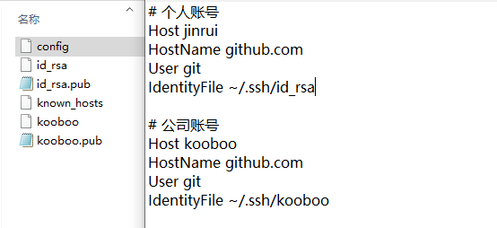
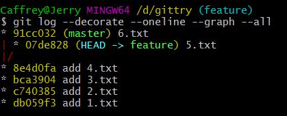

# Git学习

## 配置

```
git config --global user.name "username"

git config --global user.email "userEmail"

git config --list    查看所有配置
```

## 多账号



config内容：

```shell
# 个人账号
Host jinrui
HostName github.com
User git
IdentityFile ~/.ssh/id_rsa

# 公司账号
Host kooboo
HostName github.com
User git
IdentityFile ~/.ssh/kooboo
```


## 理论

### 三棵树

​	工作区域/目录 working Directory、暂存区域 stage(index) 和Git仓库 Repository(HEAD)

### Git工作流程

- 在工作目录中添加，修改文件 (Working directory)   工作区

- 将需要进行版本管理的文件放入暂存区域 (Stage)  暂存区
- 将暂存区域的文件提交到Git仓库 (Repository)  仓库

### Git管理文件的三种状态

- 已修改 （modified）
- 已暂存（staged）
- 已提交（committed）

## 操作

### 基础操作流程

​	`	git init`    生成隐藏的 .git文件夹(切勿改动！)

​	`git add file`  添加文件到暂存区域

​	`git commit -m "add what"`  暂存区域的文件添加到Git仓库

（git commit -am "添加到暂存区并提交"）

### 查看状态 git status

- (Untracked files  未跟踪的文件：未添加到暂存区或者Git仓库)


- (Change to be committed  添加到暂存区，但是未commit到仓库)

  #### `git reset HEAD  -- file`

  清空add命令向暂存区提交的关于file文件的修改（stage）；这个命令仅改变**暂存区**，并不改变工作区  

  	HEAD指向commit最新的那个版本
  	
  	该操作不影响工作区 (撤销  git add 操作)

- (Changes not staged for commit  已修改的文件modified未添加到暂存区staged)

  #### `git checkout -- file`

  eg. git checkout -- LICENSE        (--空格file)

  将修改的文件**丢弃工作区的更改** (*danger* *operation*)

  

- (Changes not staged for commit  AND   Change to be committed )

  工作区有一个版本未添加到暂存区，暂存区也有一个版本为提交到仓库

  可以git add将工作区的版本覆盖到暂存区，然后提交

  也可以丢弃工作区的更改git checkout -- file, 然后只提交暂存区的版本到仓库


### 撤销修改  get checkout -- file

命令`git checkout -- readme.txt`意思就是，把`readme.txt`文件在工作区的修改全部撤销，这里有两种情况：

一种是`readme.txt`自修改后还没有被放到暂存区，现在，撤销修改就回到和版本库一模一样的状态；

一种是`readme.txt`已经添加到暂存区后，又作了修改，现在，撤销修改就回到添加到暂存区后的状态。

总之，就是让这个文件回到最近一次`git commit`或`git add`时的状态。

### 查看历史提交 git log

​	查看git commit的历史和提交的说明

​	草黄色 commit id 唯一的id对应其版本

### 查看commit提交历史

```
git log --pretty=oneline --abbrev-commit
```

## 回到过去git reset

git reset HEAD -- file

### git reset --mixed HEAD~

`git reset HEAD~`      Repository(仓库)回溯一个版本(mixed默认)

`git reset HEAD~num`    num 为前num个快照

- 移动HEAD的指向，将其指向上一个快照（第三棵树，repository）
- 将HEAD移动后指向的快照回滚到暂存区域（第二棵树，staged）

Repository(仓库)的HEAD指向前一个版本，并且此时暂存区和仓库也回到之前那个版本

此时git status显示changes not staged for commit，工作区文件还在最新版本未暂存

### git reset --soft HEAD~

- 移动HEAD的指向，将其指向上一个快照（第三棵树，repository）

即只修改仓库，撤销上一次commit的提交，工作区和暂存区不变

### git reset --hard HEAD~

- 移动HEAD的指向，将其指向上一个快照（第三棵树，repository）
- 将HEAD移动后指向的快照回滚到暂存区域（第二棵树，stage）
- 将暂存区域的文件还原到工作目录（第一棵树，Working directory）

### 回滚或前滚指定快照（hash）

(hash很长，一般指定前五个就能找到确定快照了)

`git reset abcde`  

`git reset --hard hash`   前滚（默认mixed, hard能将删除的东西在工作目录恢复）

### 回滚个别文件

git reset 版本快照 文件名/路径  （HEAD不会改变）

## 版本对比

### 命令记录

`git reflog` 

当关闭了界面后无法获得回退的快照ID，可用此方法查询操作和对应的版本快照

### git diff

比较暂存区域和工作目录

--- a/README.md   旧文件   暂存区域
+++ b/README.md   新文件   工作目录

\ No newline at end of file 文件不是以换行符结束

### LINUX命令

h 帮助文档    q退出

j k  上下一行一行移动；d u 上下移动半页；f b 上下移动一页；g G 第一和最后一行；n g 第n行

/search  ？search   搜索命令,高亮匹配

### 对比两个快照的差异

`git diff id1 id2`  

### 比较当前工作目录和Git仓库

`git diff id` 

### 比较最新快照和当前目录

`git diff HEAD` 

`git diff HEAD -- readme.txt ` 命令可以查看工作区和版本库里面最新版本的区别 

### 比较暂存区和Git仓库

`git diff --cached` 

### 比较暂存区和Git仓库的快照ID

`git diff --cached [快照ID]` 

## 小技巧

### 1.修改最后一次提交  --amend

版本已提交，但是漏掉文件未添加add或者说明不完整

`git commit --amend`  进入修改界面

i  inset插入； 保存退出 需要先按 ESC，再打 `:wq` ； `:q!` 不修改直接退出

中文乱码解决： `:q!`       

`git commit --amend -m "新的说明"`    

（m: 不进入提交说明页面）

### 2.删除文件  rm

- `git checkout -- file`   恢复工作目录删除的文件

- `git rm file`  删除已经commit的文件（git仓库还在，**暂存区**和**工作目录**删除）

  `git reset --soft HEAD~`   将Git仓库已提交的文件也删掉

`git rm 文件名` 该命令删除的只是工作目录和暂存区域的文件，也就是取消跟踪，在下次提交时不纳入版本管理

- 当文件提交到暂存区`git add`但是工作目录又再次更改了文件（`git status`显示两种状态）

  此时`git rm file`删除文件会报错，不知道删工作目录还是暂存区

  `git rm -f file`  将工作目录和暂存区都（force）删除

  `git rm --cached file`  只删除暂存区，保留工作目录文件

### 3.重命名文件  mv

文件改名：`git status` 提示删除旧文件，添加了为跟踪的新文件（改回原名恢复）

git mv 旧文件名  新文件名（三步）

- ren/mv 旧文件名  新文件名
- git rm 旧文件名
- git  add新文件名

## Git分支

### 创建分支 git branch name

- 当前master分支和新name分支都指向一个快照，但是HEAD指向master
- 此时`git log --decorate` 显示内容（当前分支）
- `git log --decorate --oneline`  精简模式，一行显示一个快照

### 切换分支 git checkout name

- 更改Repository（仓库）的HEAD指向的分支
- 在新分支更改commit后，`git log` 可查看到当前指向分支
- 此时`git checkout master` 本地的在新分支的更改回消失，变成master分支内容

**相当于将master的最新快照还原到工作目录，HEAD指向master** 

- `git log --decorate --oneline --graph --all`  all(查看所有分支状态图)

### 创建并切换分支

`git checkout -b branch_name` 

### 合并分支 git merge

`git merge  branch_name`  合并到主分支master，此时分支会消失，只剩下master

- 当产生冲突时需要去修改冲突 `git add file`；`git commit -m "fix conflict"` 

### 删除分支 git branch -d name

`git branch --delete name` 

`git branch -d name` 

#### 删除未合并的分支

丢弃一个没有被合并过的分支，可以通过`git branch -D <name>`强行删除。 

### Fast forward

​	通常，合并分支时，如果可能，Git会用`Fast forward`模式，但这种模式下，删除分支后，会丢掉分支信息。

​	如果要强制禁用`Fast forward`模式，Git就会在merge时生成一个新的commit，这样，从分支历史上就可以看出分支信息。

​	准备合并`dev`分支，请注意`--no-ff`参数，表示禁用`Fast forward` 

```
git merge --no-ff -m "提交说明" dev
```

- 合并分支时，加上`--no-ff`参数就可以用普通模式合并，合并后的历史有分支，能看出来曾经做过合并，而`fast forward`合并就看不出来曾经做过合并。 

### 小结

查看分支：`git branch`

创建分支：`git branch <name>`

切换分支：`git checkout <name>`

创建+切换分支：`git checkout -b <name>`

合并某分支到当前分支：`git merge <name>`

删除分支：`git branch -d <name>` 

### 分支策略

在实际开发中，我们应该按照几个基本原则进行分支管理：

- 首先，`master`分支应该是非常稳定的，也就是仅用来发布新版本，平时不能在上面干活；
- 那在哪干活呢？干活都在`dev`分支上，也就是说，`dev`分支是不稳定的，到某个时候，比如1.0版本发布时，再把`dev`分支合并到`master`上，在`master`分支发布1.0版本；
- 你和你的小伙伴们每个人都在`dev`分支上干活，每个人都有自己的分支，时不时地往`dev`分支上合并就可以了。

所以，团队合作的分支看起来就像这样：


### 分支储藏

当需要保存当前status : no clean分支状态(未add或者commit)去其它地方修复Bug时:

- `git stash` 可以把当前工作现场“储藏”起来，等以后恢复现场后继续工作 

(此时git status会变成clean)

- 工作现场存到哪去了？用`git stash list`命令看看

- 可以多次stash，恢复的时候，先用`git stash list`查看，然后恢复指定的stash，用命令：

  ```
  $ git stash apply stash@{0}
  ```

#### 恢复stash

一是用`git stash apply`恢复，但是恢复后，stash内容并不删除，你需要用`git stash drop`来删除； 

另一种方式是用`git stash pop`，恢复的同时把stash内容也删了 

(再用`git stash list`查看，就看不到任何stash内容了)

### 匿名分支

`git checkout HEAD~1`  HEAD指向上一个快照，并创建一个匿名分支

（匿名分支所做的所有操作提交都会被丢弃）

在匿名分支修改提交`git checkout master` 

-  git branch `new-branch-name` id   提醒方法创建分支并保存匿名分支的修改

### git checkout

1.从历史快照（或者暂存区）中拷贝文件到工作目录

2.切换分支

- git checkout --fileName（暂存区覆盖到工作目录）

git checkout fileName也可以，但是可能出现分支名为fileName出现问题

- git checkout HEAD~fileName（将上一个快照的file文件复制到工作目录和暂存区）

当给定某个文件名时，Git会从指定的提交中拷贝文件到暂存区和工作目录，比如执行

### 恢复文件

- git reset fileName命令只将文件恢复到暂存区域（--mixed）

`git reset HEAD <file>`可以把暂存区的修改撤销掉（unstage），重新放回工作区 

（此时reset不允许使用--soft或者--hard）

- git checkout fileName命令同时覆盖暂存区域和工作目录
- reset比checkout安全一些，不修改工作目录

### 恢复快照

​	**reset**用来回到过去，根据选项的不同，reset命令将移动HEAD指针(--soft)->覆盖暂存区(--mixed默认)，

->覆盖工作目录(--hard)

​	**chekout** 命令是用于切换分支，通过一定HEAD指针和覆盖暂存区域、工作目录实现

### reset和checkout的区别

- checkout相比reset --hard更安全，checkout命令在切换分支之前会先检查一下当前的工作状态，如果不是clean的话，Git不会允许你这样做；而reset命令则是直接覆盖所有数据。
- reset命令会移动HEAD所在分支的指向，而checkout命令只会移动HEAD自身来指向另一个分支

`git checkout feature`   /    `git reset --hard feature`

git reset --hard feature会将整个分支回到过去，将HEAD指向的分支（master）和HEAD本身都切换到了feature，此时master分支原本做的修改会消失

- 在master分支reset feature分支


（master的修改6.txt消失）

- 在feature查看log

  


## 远程仓库

### 添加远程库

- 要关联一个远程库，使用命令`git remote add origin git@server-name:path/repo-name.git`；
- 关联后，使用命令`git push -u origin master`第一次推送master分支的所有内容；
- 此后，每次本地提交后，只要有必要，就可以使用命令`git push origin master`推送最新修改；

（`git push origin master` 将本地master分支的内容提交到远程origin仓库）

### 从远程库克隆

要克隆一个仓库，首先必须知道仓库的地址，然后使用`git clone`命令克隆。

Git支持多种协议，包括`https`，但通过`ssh`支持的原生`git`协议速度最快。

### 查看远程仓库信息

- 查看远程库的信息，用`git remote` 
- 或者，用`git remote -v`显示更详细的信息 

### 推送分支

​	把该分支上的所有本地提交推送到远程库。推送时，要指定本地分支，这样，Git就会把该分支推送到远程库对应的远程分支上 ：

```
$ git push origin master
```

如果要推送其他分支，比如`dev`，就改成：

```
$ git push origin dev
```

#### 分支推送选择

- `master`分支是主分支，因此要时刻与远程同步；
- `dev`分支是开发分支，团队所有成员都需要在上面工作，所以也需要与远程同步；
- bug分支只用于在本地修复bug，就没必要推到远程了，除非老板要看看你每周到底修复了几个bug；
- feature分支是否推到远程，取决于你是否和你的小伙伴合作在上面开发。

## 多人协作

多人协作的工作模式通常是这样：

1. 首先，可以试图用`git push origin <branch-name>`推送自己的修改；
2. 如果推送失败，则因为远程分支比你的本地更新，需要先用`git pull`试图合并；
3. 如果合并有冲突，则解决冲突，并在本地提交；
4. 没有冲突或者解决掉冲突后，再用`git push origin <branch-name>`推送就能成功！

如果`git pull`提示`no tracking information`，则说明本地分支和远程分支的链接关系没有创建，用命令`git branch --set-upstream-to <branch-name> origin/<branch-name>`。

这就是多人协作的工作模式，一旦熟悉了，就非常简单。

### 创建远程`origin`的`dev`分支到本地

`git checkout  -b dev origin/dev` 

分支推送  `git push origin dev` 

### 冲突解决

先用`git pull`把最新的提交从`origin/dev`抓下来，然后，在本地合并，解决冲突，再推送

### git pull失败

例如在dev分支git pull提示：There is no tracking information for the current branch.

- 原因是没有指定本地`dev`分支与远程`origin/dev`分支的链接，根据提示，设置`dev`和`origin/dev`的链接 

**解决**： 

```
$ git branch --set-upstream-to=origin/dev dev
$ git pull
解决冲突
$ git commit -m "fix conflict"
$ git push origin dev
```

### 小结

- 查看远程库信息，使用`git remote -v`；
- 本地新建的分支如果不推送到远程，对其他人就是不可见的；
- 从本地推送分支，使用`git push origin branch-name`，如果推送失败，先用`git pull`抓取远程的新提交；
- 在本地创建和远程分支对应的分支，使用`git checkout -b branch-name origin/branch-name`，本地和远程分支的名称最好一致；
- 建立本地分支和远程分支的关联，使用`git branch --set-upstream branch-name origin/branch-name`；
- 从远程抓取分支，使用`git pull`，如果有冲突，要先处理冲突。

### Rebase

把分叉的提交历史“整理”成一条直线，看上去更直观。缺点是本地的分叉提交已经被修改过了。 

可以git push之前整理分支提交历史

## 标签管理

Git的标签虽然是版本库的快照，但其实它就是指向某个commit的指针（跟分支很像对不对？但是分支可以移动，标签不能移动），所以，创建和删除标签都是瞬间完成的 

### 创建标签

`git tag <name>`就可以打一个新标签 

查看标签   `git tag` 

- 对commit历史的某个提交打标签：

```
$ git log --pretty=oneline --abbrev-commit
$ git tag v0.9 f52c633
$ git tag
$ git show v0.9
```

#### 带有说明的标签

用`-a`指定标签名，`-m`指定说明文字：

```
$ git tag -a v0.1 -m "version 0.1 released" 1094adb
```

#### 小结

- 命令`git tag <tagname>`用于新建一个标签，默认为`HEAD`，也可以指定一个commit id；
- 命令`git tag -a <tagname> -m "blablabla..."`可以指定标签信息；
- 命令`git tag`可以查看所有标签。

### 操作标签

#### 删除

​	 `git tag -d v0.9`

​	因为创建的标签都只存储在本地，不会自动推送到远程。所以，打错的标签可以在本地安全删除。

#### 推送标签到远程

​	使用命令   `push origin <tagname>` 推送某个标签

​	`git push origin --tags` 推送所有标签

#### 删除已推送标签

1. 删除本地标签： `git tag -d v0.9`
2. 删除远程标签：`git push origin :refs/tags/v0.9` 

#### 小结

- 命令`git push origin <tagname>`可以推送一个本地标签；
- 命令`git push origin --tags`可以推送全部未推送过的本地标签；
- 命令`git tag -d <tagname>`可以删除一个本地标签；
- 命令`git push origin :refs/tags/<tagname>`可以删除一个远程标签。


