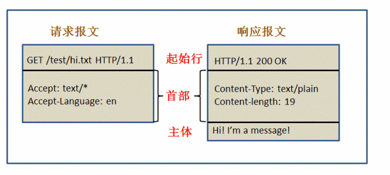

# HTTP

## 5层网络协议模型

1. 应用层（HTTP、FTP）
2. 传输层（TCP、UDP）
3. 网络层
4. 数据链路层
5. 物理层


## HTTP的三次握手

所谓的“三次握手”：为了对每次发送的数据量进行跟踪与协商，确保数据段的发送和接收同步，根据所接收到的数据量而确认数据发送、接收完毕后何时撤消联系，并建立虚连接。 [1] 

为了提供可靠的传送，TCP在发送新的数之前，以特定的顺序将数据包的序号，并需要这些包传送给目标机之后的确认消息。TCP总是用来发送大批量的数据。当应用程序在收到数据后要做出确认时也要用到TCP


## URI  URL-URN

1. #### URI = Universal Resource Identifier 统一资源标志符

   它包含URL和URN

2. #### URL = Universal Resource Locator 统一资源定位符

   URL唯一地标识一个资源在Internet上的位置。不管用什么方法表示，只要能定位一个资源，就叫URL。

3. #### URN = Universal Resource Name 统一资源名称

   URN它命名资源但不指定如何定位资源，比如：只告诉你一个人的姓名，不告诉你这个人在哪。例如：telnet、mailto、news 和 isbn URI 等都是URN。

4. URI、URL和URN区别

   - URI 指的是一个资源
   - URL 用地址定位一个资源
   - URN 用名称定位一个资源


## HTTP报文格式



http方法：用来定义对资源的操作（GET、POST...）

http code：定义服务器对请求的处理结果


## curl指令的简单应用

**curl** 是常用的命令行工具，用来请求 Web 服务器。它的名字就是客户端（client）的 URL 工具的意思。

它的功能非常强大，命令行参数多达几十种。如果熟练的话，完全可以取代 Postman 这一类的图形界面工具。


- 不带有任何参数时，curl 就是发出 GET 请求。

> ```bash
> $ curl https://www.example.com
> ```

上面命令向`www.example.com`发出 GET 请求，服务器返回的内容会在命令行输出。

- **-v**

`-v`参数输出通信的整个过程，用于调试。

> ```bash
> $ curl -v https://www.example.com
> ```

`--trace`参数也可以用于调试，还会输出原始的二进制数据。

> ```bash
> $ curl --trace - https://www.example.com
> ```

[More]: http://www.ruanyifeng.com/blog/2019/09/curl-reference.html	"CURL"

## 跨域

#### Access-Control-Allow-Origin


在8888端口下返回test.html文件，在test中访问8887端口

**跨域会导致浏览器拦截response：**Access to XMLHttpRequest at 'http://localhost:8887/' from origin 'http://localhost:8888' has been blocked by CORS policy: No 'Access-Control-Allow-Origin' header is present on the requested resource.

```js
response.writeHead(200, {
	'Access-Control-Allow-Origin': '*'
})
```

*： 表示允许任何服务都接受，可以设置特地域名

```js
response.writeHead(200, {
	'Access-Control-Allow-Origin': 'http://localhost:8888'
})
```


### JSONP

原理：浏览器允许link script和img标签加载数据，不需要设置允许跨域Access-Control-Allow-Origin

