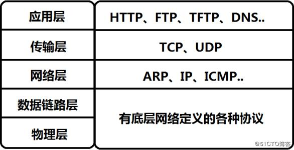
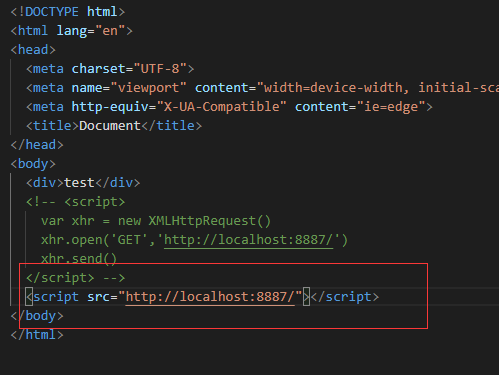

# HTTP

## 5层网络协议模型

1. 应用层（HTTP、FTP）
2. 传输层（TCP、UDP）
3. 网络层
4. 数据链路层
5. 物理层




## HTTP的三次握手

所谓的“三次握手”：为了对每次发送的数据量进行跟踪与协商，确保数据段的发送和接收同步，根据所接收到的数据量而确认数据发送、接收完毕后何时撤消联系，并建立虚连接。 [1] 

为了提供可靠的传送，TCP在发送新的数之前，以特定的顺序将数据包的序号，并需要这些包传送给目标机之后的确认消息。TCP总是用来发送大批量的数据。当应用程序在收到数据后要做出确认时也要用到TCP


## URI  URL-URN

1. #### URI = Universal Resource Identifier 统一资源标志符

   ​		它包含URL和URN

2. #### URL = Universal Resource Locator 统一资源定位符

   ​		URL唯一地标识一个资源在Internet上的位置。不管用什么方法表示，只要能定位一个资源，就叫URL。

3. #### URN = Universal Resource Name 统一资源名称

   ​		URN它命名资源但不指定如何定位资源，比如：只告诉你一个人的姓名，不告诉你这个人在哪。例如：telnet、mailto、news 和 isbn URI 等都是URN。

4. URI、URL和URN区别

   - URI 指的是一个资源
   - URL 用地址定位一个资源
   - URN 用名称定位一个资源


## HTTP报文格式


​		http方法：用来定义对资源的操作（GET、POST...）

​		http code：定义服务器对请求的处理结果


## curl指令的简单应用

​		curl它的功能非常强大，命令行参数多达几十种。如果熟练的话，完全可以取代 Postman 这一类的图形界面工具。


- 不带有任何参数时，curl 就是发出 GET 请求。

> ```bash
> $ curl https://www.example.com
> ```

上面命令向`www.example.com`发出 GET 请求，服务器返回的内容会在命令行输出。

- **-v**

`-v`参数输出通信的整个过程，用于调试。

> ```bash
> $ curl -v https://www.example.com
> ```

`--trace`参数也可以用于调试，还会输出原始的二进制数据。

> ```bash
> $ curl --trace - https://www.example.com
> ```

## 跨域

### Access-Control-Allow-Origin


在8888端口下返回test.html文件，在test中访问8887端口

**跨域会导致浏览器拦截response：**Access to XMLHttpRequest at 'http://localhost:8887/' from origin 'http://localhost:8888' has been blocked by CORS policy: No 'Access-Control-Allow-Origin' header is present on the requested resource.

```js
response.writeHead(200, {
	'Access-Control-Allow-Origin': '*'
})
```

*： 表示允许任何服务都接受，可以设置特地域名

```js
response.writeHead(200, {
	'Access-Control-Allow-Origin': 'http://localhost:8888'
})
```


### JSONP

原理：浏览器允许link script和img标签加载数据，不需要设置允许跨域Access-Control-Allow-Origin



## CORS跨域限制以及请求校验

### 限制

​		保持Access-Control-Allow-Origin允许之下，仍然是有限制的（返回200但是浏览器不允许）

- 允许方法: GET、HEAD、POST
- 允许的Content-Type: text/plain、multipart/form-data、application/x-www-form-urlencoded
- 其他限制：请求头限制、XMLHttpRequestUpload对象均没有注册任何事件监听器、请求中没有使用ReadableStream对象

method限制：

```js
    fetch('http://localhost:8887/', {
      method: 'POST',
      headers: {
        'X-Test-Cors': '123'
      }
    })
```

### 浏览器跨域预请求

```js
response.writeHead(200, {
    'Access-Control-Allow-Origin': '*',
    'Access-Control-Allow-Headers': 'X-Test-Cors',
    'Access-Control-Allow-Methods': 'POST,PUT,Delete',
    'Access-Control-Max-Age': '1000'
  })
```

​		通过服务端设置允许的请求头来保证这个跨域请求的进行，在查看Network时会看到有两条请求记录吗，先是OPTIONS请求验证服务端是否允许此请求头的跨域，通过之后才是POST请求：

1. OPTIONS
2. POST

   保证跨域操作的安全性，对跨域方法和请求头的限制

### Access-Control-Max-Age

​		表示跨域请求的参数事件内在第一次预请求之后的时间内不需要再发送OPTIONS预请求（second）


## Cache-Control缓存

这个请求头只是一个希望你按照的这个规则来，你可以不遵守

### 可缓存性

- public: 代表http经过的任何地方，客户端、浏览器、包括代理的中间服务器都可以进行缓存
- private: 只有发起请求的浏览器可以进行和缓存
- no-cache: 可以缓存的，但是每次访问缓存之前需要发送一个请求验证是否可以使用缓存的数据

### 到期 

#### max-age (s)

​		指这个缓存什么时候到期，之后需要重新发起请求而不能读取缓存的内容。

```js
response.writeHeader(200, {
    'Content-Type': 'text/javascript',
    'Cache-Control': 'max-age=200'   // 请求后的200s内再请求可使用缓存数据
})
```


#### s-maxage(s)

​		在浏览器中会读取max-age, 但是在代理服务器中如果同时存在max-age和s-maxage, 会读取s-maxage。

#### max-stale(s)

​		发起请求的一方主动带的一个请求头，即使max-age已经过期，超出max-age时间的响应消息如果还在max-stale有效期之内，还能读取缓存的内容，而不需要重新发起请求。

​		此时max-age和max-stale和

### 重新验证*

#### must-revalidate

​		缓存如果过期必须从原服务端发送请求验证这个缓存是否真的过期，来重新获取数据，而不能读取本地缓存

#### proxy-revalidate

​		在代理服务器中需要重新验证

### 其他

#### no-store

​		客户端和代理服务器都不可以使用缓存数据，必须重新发送请求

#### no-transform

​		代理服务器不能改动数据，例如压缩等等操作

## no-cache资源验证

### Last-Modified

​		上次修改的时间，配合**If-Modified-Since**或者**If-Unmodifiled-Since**使用

​		服务端设置Last-Modified，下次请求会带上If-Modified-Since，以此判断资源是否修改过，然后确认要不要读取缓存的数据还是重新发起请求

### Etag

​		数据签名，资源修改后就更新Etag，配合例如对内容进行一个hash计算，判断两者是否一样，配合If-Match和If-Non-Match使用

```js
response.writeHeader(200, {
    'Content-Type': 'text/javascript',
    'Cache-Control': 'max-age=200000，no-cache',   // no-cache
    'Last-Modified': 'data1',
    'Etag': 'data2'
})

// request  head
// If-Modified-Since: data1
// If-Non-Match：data2

if (etag === data2) {
    response.writeHeader(304, {
        'Content-Type': 'text/javascript',
        'Cache-Control': 'max-age=200000，no-cache',   // no-cache
        'Last-Modified': 'data1',
        'Etag': 'data2'
    })
}
```

- 当请求返回304（Not-Modified）时，此时使用本地缓存的数据，在respond里面的内容是不会返回的


## cookie和session

### cookie

- node里面通过Set-Cookie设置
- 下次请求的head里面会自动带上这个数据
- 可以设置多个key=value

#### 属性

- max-age和expires设置过期时间
- Secure只在https的时候发送
- HttpOnly无法通过document.cookie访问

*cookie的过期时间是在浏览器关闭之后失效，在没有设置过期时间的情况下*

1. 过期之后下次请求Request Headers的Cookie便不会带上这个key=value
2. max-age值有效时间是多长，expires指到这个时间点过期

```js
response.writeHeader(200, {
    'Content-Type': 'text/javascript',
    'Set-Cookie': ['id=123;max-age=10','abc=456；HttpOnly']
})
```

#### cookie domain

cookie在当前域下写入在其他域是无法访问的

但是如果在test.com里面设置了cookie,二级域名下a.test.com/b.test.com都可以访问

### session

cookie不等于session，session的实现方式有很多种，cookie只是其中一种

例如通过对不同用户设置不同的唯一的cookie的key=value值，来**定位用户的数据**

## HTTP长连接

http的创建过程中需要创建一个TCP连接，长连接可以保持TCP的连接不关闭，减少三次握手导致的开销

chrome下可以最多保持6个TCP的并发，那么http长连接可以在此6个TCP连接内传输

现代浏览器下和框架下一般都是长连接 Connection: keep-alive   (close)

```js
response.writeHeader(200, {
    'Content-Type': '......',
    'Connection': 'close'
})
// 每个http请求都要创建一个TCP连接
```

HTTP2：信道复用，tcp内可以并发http请求