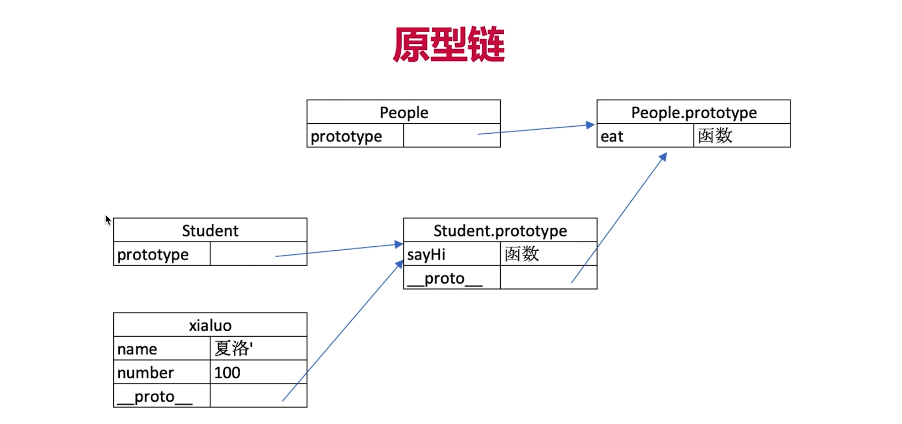
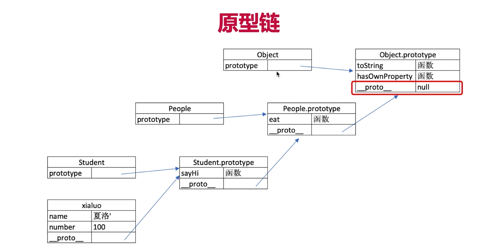

# JavaScript

## 变量类型和引用类型

### 值类型和引用类型

```javascript
// 值类型
let a = 100
let b = a
a = 200
console.log(b)  // b = 100

// 引用类型(现象：相互影响)
let a = {age: 20}
let b = a
b.age = 21
console.log(a.age)   // 21
```

- 栈：从上往下增加
- 堆：从下往上增加

| 栈   |       |      | 栈   |       |      | 栈   |       |
| ---- | ----- | ---- | ---- | ----- | ---- | ---- | ----- |
| key  | value |      | key  | value |      | key  | value |
| a    | 100   |      | a    | 100   |      | a    | 200   |
|      |       |      | b    | 100   |      | b    | 100   |


| 栈   |           |      | 栈   |           |      | 栈   |           |
| ---- | --------- | ---- | ---- | --------- | ---- | ---- | --------- |
| key  | value     |      | key  | value     |      | key  | value     |
| a    | 内存地址1 |      | a    | 内存地址1 |      | a    | 内存地址1 |
|      |           |      | b    | 内存地址1 |      | b    | 内存地址1 |

|           |             |      |           |             |      |           |            |
| --------- | ----------- | ---- | --------- | ----------- | ---- | --------- | ---------- |
| 内存地址1 | { age: 20 } |      | 内存地址1 | { age: 20 } |      | 内存地址1 | { age: 21} |
| key       | value       |      | key       | value       |      | key       | value      |
| **堆**    |             |      | **堆**    |             |      | **堆**    |            |

- 值类型的占用空间少，直接复制快；

- 引用类型有的时候占用类型会很大，直接复制会导致存储空间太大，而且直接复制可能会很慢

常见的值类型

```javascript
let a  // undefined
const s = 'abc'
const n = 100
const b = true
const s = Symbol('s')
```

常见的引用类型

```javascript
const obj = { x: 100 }
const arr = ['a', 'b', 'c']

const n = null  // 特殊引用类型，指针指向为空地址

// 特殊引用类型，但不用于存储数据，所以没有“拷贝、复制函数”一说
function () {}
```

### typeof运算符和深拷贝

- typeof

type能判读哪些类型：1.识别所以的值类型； 2.识别函数；  3.判断是否是引用类型

```javascript
// 判断所有值类型
let a;                   		typeof a   // 'undefined'
const str = 'abc';				typeof str // 'string'				
const n = 100;					typeof n   // 'number'
const b = true;					typeof b   // 'boolean'
const s = Symbol('s')			typeof s   // 'symbol'

// 能判断函数
typeof console.log()   // 'function'
typeof function(){}    // 'function'

// 能识别引用类型 （不能再继续识别）
type null              // 'object'
type ['a','b']         // 'object'
type { age: 20}        // 'object'
```

- 简单深拷贝
  1. 注意判断是值类型还是引用类型
  2. 注意判断是数组还是对象
  3. 递归

```javascript
function deepClone( obj = {}) {
    if(typeof(obj) !=='object' || typeof(obj) == null) {
        // obj是null,或者不是对象和数组，直接返回
        return obj
    }
    
    // 初始化返回结果
    let result
    if (obj instanceof Array) {
        result = []
    } else {
        result = {}
    }
    
    for (key in obj) {
        // 保证key不是原型的属性
        if(obj.hasOwnProperty(key)) {
            // 递归调用
            result[key] = deepClone(obj[key])
        }
    }
    
    return result
}
```

### 变量计算

- 字符串拼接

```javascript
const a = 100 + 10          // 110
const b = 100 + '10'        // '10010'    100+parseInt('10') === 110
const c = true + '10'       // 'true10'
```

- ==运算符

```javascript
// true
100 == '100'    
0 == ''
0 == false
fase == ''
null == undefined

// 除了 == null 之外，其他一律用 === ，例如

const obj = { x: 100 }
if(obj.a == null) {}
// 相当于:
// if (obj.a === null || obj.a === undefined) {}
```

- if语句和逻辑运算

1. truly变量： !!a === true 的变量
2. falsely变量： !!a === false 的变量

truly和falsely变量是经过两步取反后为true或者false的变量

```
// 一下是 falsely变量。 除此之外都是truely变量
!!0 === false
!!NaN === false
!!'' === false
!!null === false
!!undefined === false
!!false === false
```

- 逻辑判断

```javascript
console.log(10 && 0)            // 0
console.log('' || 'abc')        // 'abc'
console.log(!window.abc)        // true
```

## 原型和原型链

JavaScript是一个基于原型继承的，ES6的class其实也是原型继承

### class和继承

- constructor
- 属性
- 方法

```javascript
class Student {
    constructor (name,number) {
        this.name = name
        this,number = number
    }
    sayHi () {
        console.log(`姓名 ${this.name}, 学号 ${this.number}`)
    }
}

// 通过类 new 实例/对象
const caffrey = new Student('caffrey', 18)
console.log(caffrey.name)
console.log(caffrey.number)
caffrey.sayHi()
```

- class继承(extends)

```javascript
// 父类
class People {
    constructor (name) {
        this.name = name
    }
    eat() {
        console.log(`${this.name} eat a log`)
    }
}

// 子类
class Student extends People {
    constructor(name,number) {
        super(name)
        this.age = number
    }
    sayHi () {
        console.log(`姓名 ${this.name}, 学号 ${this.number}`)
    }
}

// 通过类 new 实例/对象
const caffrey = new Student('caffrey', 18)
console.log(caffrey.name)
console.log(caffrey.number)
caffrey.eat()
caffrey.sayHi()
```

### 原型

- 类型判断 - instanceof

```javascript
caffrey instanceof Student    // true
caffrey instanceof People     // true
caffrey instanceof Object     // true

[] instanceof Array     // true
[] instanceof Object    // true

{} instanceof Object    // true
```

- 原型

```
// class 实际上是函数， 可见是语法糖
typeof People   // 'function'
typeof Student   // 'function'

// 隐式原型和显式原型
console.log( caffrey.__proto__ )
console.log( Student.prototype )
console.log( caffrey.__proto === Student.prototype )    // true
```


- **原型关系**

1. 每个class都有显式原型
2. 每个实例都有隐式原型
3. 实例的隐式原型指向对应 class 的prototype(显式原型)

- **基于原型的执行规则**

1. 获取属性 caffrey.name 或执行方法 caffrey.sayHi( )时
2. 现在自身属性和方法寻找
3. 如果找不到则自动去隐式原型中寻找

### 原型链和instanceof

**实例的隐式原型指向构造函数的显式原型**

```
// student继承于People  
console.log( Student.prototype.__proto__ )
console.log( People.prototype )
console.log( Student.prototype.__proto__ === People.prototype )    // true
```



#### hasOwnProperty

```javascript
// hasOwnProperty检测是不是自身属性（非继承）
caffrey.name                            // 'caffrey'
caffrey.hasOwnProperty('name')          // true

caffrey.sayHi()                         // '姓名 caffrey , 学号 18'
caffrey.hasOwnProperty('sayHi')         // false
caffrey.hasOwnProperty('eat')           // false
```



#### instanceof

实例沿着隐式原型链往上寻找，如果隐式原型能对应到class(构造函数)的显示原型，则返回true,否则返回false


1. class是ES6语法规范，由ECMA委员会发布
2. ECMA只规定语法规则，即我们的代码的书写规范，不规定如何实现
3. 以上实现方式都是V8引擎（yinqing）的实现方式，也是主流的

### 回顾

- 手写一个简易的jQuery,考虑插件和扩展性

```javascript
class jQuery {
    constructor(selector) {
        const result = document.querySelectorAll(selector)
        const length = result.length
        for(let i =0; i<length; i++) {
            this[i] = result[i]
        }
        this.length = length
        this.selector = selector
    }
    get(index) {
        return this[index]
    }
    each(fn) {
        for(let i =0; i<length; i++) {
            const elem = this[i]
            fn(elem)
        }
    }
    on(type, fn) {
        return this.each(elem => {
            elem.addEventListener(type, fn, false)
        })
    }
    ......
}
    
// 插件
   	jQuery.prototype.dialog = function (info) { alert(info) }
// "造轮子"
	class myJQuery extends jQuery {
        constructor(selector) {
            super(selector)
        }
        // 扩展自己的方法
        addClass(className) {
            ...
        }
    }
    
//  const $p = new jQuery('p')
//  $p.get(1)
//  $p.each(elem=> console.log(elem.nodeName))
//  $p.on('click',()=>alert('clicked'))
```

