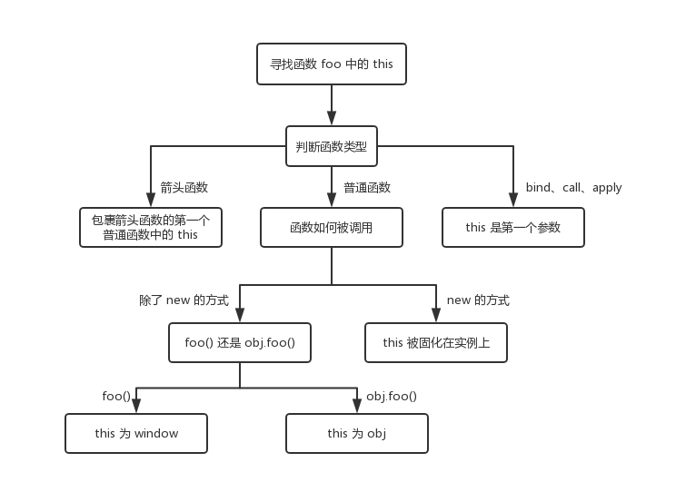

# JavaScript笔记

## JavaScript解答

### new的过程

无论是通过字面量还是通过`new`进行构造函数调用创建出来的对象，其实都一样。调用`new`的过程如下：

1. 创建一个新对象
2. 原型绑定
3. 绑定this到这个新对象上
4. 返回新对象

### this全解析

`JavaScript`中的`this`只有如下几种情况，并按他们的优先级从低到高划分如下：

1. 独立函数调用，例如`getUserInfo()`，此时`this`指向全局对象`window`
2. 对象调用，例如`stu.getStudentName()`，此时`this`指向调用的对象`stu`
3. `call()`、`apply()`和`bind()`改变上下文的方法，`this`指向取决于这些方法的第一个参数，当第一个参数为`null`时，`this`指向全局对象`window`
4. 箭头函数没有`this`，箭头函数里面的`this`只取决于包裹箭头函数的第一个普通函数的`this`
5. `new`构造函数调用，`this`永远指向构造函数返回的实例上，优先级最高。

```js
var name = 'global name';
var foo = function() {
  console.log(this.name);
}
var Person = function(name) {
  this.name = name;
}
Person.prototype.getName = function() {
  console.log(this.name);
}
var obj = {
  name: 'obj name',
  foo: foo
}
var obj1 = {
  name: 'obj1 name'
}

// 独立函数调用，输出：global name
foo();
// 对象调用，输出：obj name
obj.foo();
// apply()，输出：obj1 name
obj.foo.apply(obj1);
// new 构造函数调用，输出：p1 name
var p1 = new Person('p1 name');
p1.getName();
```



## ES6 module

```js
// a.js  导出多个
export function fn() {
	console.log('fn')
}

export const obj = {
	name: 'zhangsan'
}
```

```js
// b.js  导出多个
function fn1() {
	console.log('fn')
}

const obj1 = {
	name: 'zhangsan'
}

export {
	fn1,
	obj1
}
```

```js
// index.js
import { fn, obj} from './a'
import { fn1, obj1} from './b'
```

- 使用了default之后不能用解构赋值

```js
// c.js  导出单个
const obj = {
	data: 'hello c'
}

export default obj
```

```js
// d.js  导出多个
function fn2() {
	console.log('fn')
}

const obj2 = {
	name: 'zhangsan'
}

export default {
	fn1,
	obj1
}
```

```js
// index.js
import obj from './c'
import d from './d'         // 不能用解构赋值

console.log(d.fn2, d.obj2)
```

## linux命令

### 本地登录线上地址

```sh
ssh username@192.168.**.**
password: password
```

### 文件操作

```sh
// 查看文件（平铺）
ls
// 查看所有文件 .babel这种.开头的隐藏文件
ls -a
// 查看文件（列表）
ll
// 清屏
clear
// 创建/删除文件夹 -rf  f:force
mkdir foldername
rm -rf folder
// 定位目录
cd dist
// 修改文件名
mv file file
// 移动文件 将当前file移动到上级目录，命名为file
mv file ../file
// 文件拷贝
cp a.js a1.js
// 新建文件
```

```sh
// 删除文件(可以不用 -rf)
rm a.js
// 新建文件
touch a.js
// 新建文件且打开vim(如果文件存在则直接打开)
vi d.js
i (insert输入状态)
esc (退出insert模式)
: w enter  (shift+; , w 写入保存, 回车)
：q  (shift : , q 退出)
// 打开文件,打印出所有数据
cat d.js
// 打开文件,打印出前/后面几行数据
head d.js
tail d.js
// 在package.json文件内查找babel
grep "babel" package.json
```

### VIM编辑器

- i 进入insert 写入状态
- 键盘上下左右可移动

- esc退出状态
- : w 保存
- : q 退出
- : q! 强制退出（不保存）
- vimtutor 查看vim编辑器文档

