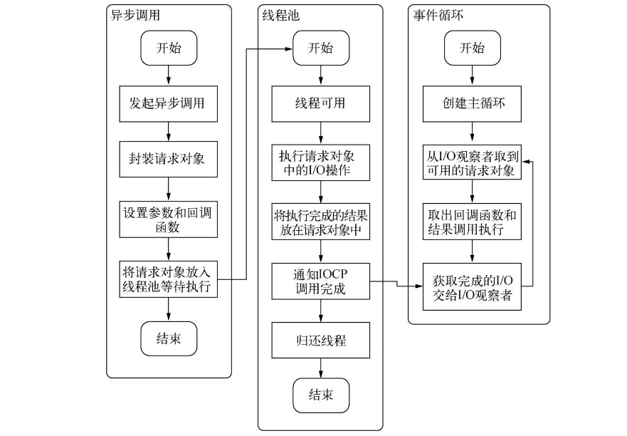
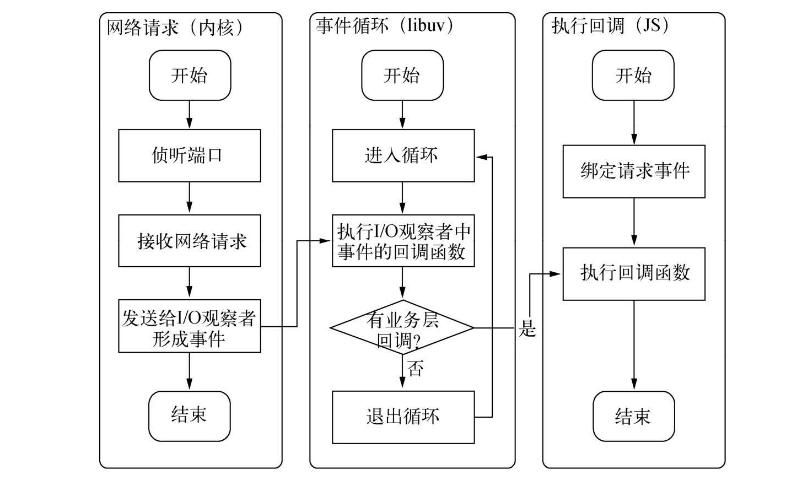

## Node引入模块

1. 路径分析
2. 文件定位
3. 编译执行

::: tip 

​		在node中，模块分为两类：核心模块（Node提供的模块）; 文件模块（用户编写的模块）

​		核心模块在Node源代码的编译中已经编译进了二进制执行文件。在node进程启动时，部分核心模块就被直接加载进内存中，这部分模块的引入省略了文件定位和编译执行的步骤。且在路径分析中是优先判断，加载速度最快。

​		文件模块是在运行时动态加载，需要完整的模块引入步骤。

:::


## CommonJs,AMD和CMD

::: tip 对比

- Node提出了commonJs的规范，基于此组织了自身的原生模块。

- CommonJs规范主要服务器端，NPM是对此规范的支持产物。
- AMD和CMD在浏览器环境

:::

模块写成对象，同时**立即执行函数**保证了外部无法访问内部私有变量

```js
var module = (function(){
    var star = 0;
    var f1 = function (){
        console.log('ok');
    };
    // IIFE只返回一个包含f1方法的对象
    return {
        f1
    };
})();
module.f1();  // ok
console.log(module.star)  // undefined 无法访问私有变量
```

以下参考阅读：https://www.jianshu.com/p/d67bc79976e6

### commonJs

::: tip commonJs

- 一个单独的文件就是一个模块。每一个模块都是一个单独的作用域，也就是说，在该模块内部定义的变量，无法被其他模块读取，除非定义为`global`对象的属性。
- 输出模块变量的最好方法是使用`module.exports`对象。
- 加载模块使用`require`方法，该方法读取一个文件并执行，返回文件内部的`module.exports`对象

::: 

```js
//   math.js
exports.add = function() {
    var sum = 0, i = 0, args = arguments, l = args.length;
    while (i < l) {
        sum += args[i++];
    }
    return sum;
};

//  increment.js
var add = require('math').add;
exports.increment = function(val) {
    return add(val, 1);
};

//  index.js
var increment = require('increment').increment;
var a = increment(1); //2
```

::: warning 浏览器端异步问题

-  `require` 是**同步**的。模块系统需要同步读取模块文件内容，并编译执行以得到模块接口。
   然而， 这在浏览器端问题多多。
- 浏览器端，加载 JavaScript 最佳、最容易的方式是在 `document` 中插入`script`标签。但脚本标签天生异步，传统 CommonJS 模块在浏览器环境中无法正常加载。
- 解决思路之一是，开发一个服务器端组件，对模块代码作静态分析，将模块与它的依赖列表一起返回给浏览器端。 这很好使，但需要服务器安装额外的组件，并因此要调整一系列底层架构。

:::

另一种解决思路是，用一套**标准模板**来封装模块定义：

```js
define(function(require, exports, module) {

  // The module code goes here

});
```

这套模板代码为模块加载器提供了机会，使其能在模块代码执行之前，对模块代码进行静态分析，并动态生成依赖列表。

```js
//  math.js
define(function(require, exports, module) {
  exports.add = function() {
    var sum = 0, i = 0, args = arguments, l = args.length;
    while (i < l) {
      sum += args[i++];
    }
    return sum;
  };
});

//  increment.js
define(function(require, exports, module) {
  var add = require('math').add;
  exports.increment = function(val) {
    return add(val, 1);
  };
});

//  index.js
define(function(require, exports, module) {
  var inc = require('increment').increment;
  inc(1); // 2
});
```

### AMD

::: tip AMD

1. AMD是`"Asynchronous Module Definition"`的缩写，意思就是"异步模块定义"。由于不是JavaScript原生支持，使用AMD规范进行页面开发需要用到对应的库函数，也就是大名鼎鼎`RequireJS`，实际上AMD 是 `RequireJS` 在推广过程中对模块定义的规范化的产出
2. 它采用异步方式加载模块，模块的加载不影响它后面语句的运行。所有依赖这个模块的语句，都定义在一个回调函数中，等到加载完成之后，这个回调函数才会运行。
3. `RequireJS`主要解决**两个问题**

- 多个js文件可能有依赖关系，被依赖的文件需要早于依赖它的文件加载到浏览器
- js加载的时候浏览器会停止页面渲染，加载文件越多，页面失去响应时间越长

:::

::: tip RequireJs

**RequireJs**也采用require()语句加载模块，但是不同于CommonJS，它要求两个参数:

1. 第一个参数[module]，是一个数组，里面的成员就是要加载的模块；
2. 第二个参数callback，则是加载成功之后的回调函数。math.add()与math模块加载不是同步的，浏览器不会发生假死。

:::

```ruby
require([module], callback);

require([increment'], function (increment) {
　   increment.add(1);
});
```

#### define()函数

​		`RequireJS`定义了一个函数 `define`，它是全局变量，用来定义模块:
 `define(id?, dependencies?, factory);`
::: tip  参数说明：

- id：指定义中模块的名字，可选；如果没有提供该参数，模块的名字应该默认为模块加载器请求的指定脚本的名字。如果提供了该参数，模块名必须是“顶级”的和绝对的（不允许相对名字）。
- 依赖dependencies：是一个当前模块依赖的，已被模块定义的模块标识的数组字面量。
   依赖参数是可选的，如果忽略此参数，它应该默认为["require", "exports", "module"]。然而，如果工厂方法的长度属性小于3，加载器会选择以函数的长度属性指定的参数个数调用工厂方法。
- 工厂方法factory，模块初始化要执行的函数或对象。如果为函数，它应该只被执行一次。如果是对象，此对象应该为模块的输出值。

:::

来举个🌰看看：

```js
define("alpha", ["require", "exports", "beta"], function (require, exports, beta) {
    exports.verb = function() {
        return beta.verb();
        //Or:
        return require("beta").verb();
    }
});
```

#### RequireJs使用例子

​		`require.config`是用来定义别名的，在paths属性下配置别名。然后通过`requirejs`(参数一，参数二)；参数一是数组，传入我们需要引用的模块名，第二个参数是个回调函数，回调函数传入一个变量，代替刚才所引入的模块。

```jsx
main.js
//别名配置
requirejs.config({
    paths: {
        jquery: 'jquery.min' //可以省略.js
    }
});
//引入模块，用变量$表示jquery模块
requirejs(['jquery'], function ($) {
    $('body').css('background-color','red');
});
```

​		引入模块也可以只写`require()`。`requirejs`通过`define()`定义模块，定义的参数上同。在此模块内的方法和变量外部是无法访问的，只有通过`return`返回才行.

```jsx
//  math.js
define('math',['jquery'], function ($) {//引入jQuery模块
    return {
        add: function(x,y){
            return x + y;
        }
    };
});
```

​		将该模块命名为math.js保存

```jsx
require(['jquery','math'], function ($,math) {
    console.log(math.add(10,100));//110
});
```

​		main.js引入模块方法

### CMD

::: tip CMD

​		CMD 即`Common Module Definition`通用模块定义，CMD规范是国内发展出来的，就像AMD有个`requireJS`，CMD有个浏览器的实现`SeaJS`，`SeaJS`要解决的问题和`requireJS`一样，只不过在模块定义方式和模块加载（可以说运行、解析）时机上有所不同。

::: 

在 CMD 规范中，一个模块就是一个文件。代码的书写格式如下:

```tsx
define(function(require, exports, module) {

  // 模块代码

});
```

​		`require`是可以把其他模块导入进来的一个参数;而`exports`是可以把模块内的一些属性和方法导出的;`module` 是一个对象，上面存储了与当前模块相关联的一些属性和方法。

- AMD是依赖关系前置,在定义模块的时候就要声明其依赖的模块;
- CMD是按需加载依赖就近,只有在用到某个模块的时候再去require：

```jsx
// CMD
define(function(require, exports, module) {
  var a = require('./a')
  a.doSomething()
  // 此处略去 100 行
  var b = require('./b') // 依赖可以就近书写
  b.doSomething()
  // ... 
})

// AMD 默认推荐的是
define(['./a', './b'], function(a, b) { // 依赖必须一开始就写好
  a.doSomething()
  // 此处略去 100 行
  b.doSomething()
  ...
}) 
```

#### seajs使用例子

```jsx
// 定义模块  myModule.js
define(function(require, exports, module) {
  var $ = require('jquery.js')
  $('div').addClass('active');
  exports.data = 1;
});

// 加载模块
seajs.use(['myModule.js'], function(my){
    var star= my.data;
    console.log(star);  //1
});
```

<<<<<<< HEAD
## Node的异步I/O

::: tip

完成整个异步I/O环节有

- 事件循环：每执行一次事件循环称为Tick
- 观察者：事件循环中有一个或多个观察者来判断是否还有需要处理的事件
- 请求对象：存在于Js发起调用到内核执行完I/O操作的过渡过程中，保存异步I/O的所有状态

:::


​		上图为整个异步I/O的流程，事件循环、观察者、请求对象、I/O线程池这四者共同构成了Node异步I/O模型的基本要素。

## 异步编程

### 函数式编程

::: tip JavaScript的回调函数和深层嵌套

​		在JavaScript中，函数（function）作为一等公民，使用上非常自由，无论调用它，或者作为参数，或者作为返回值均可。

​		JavaScript的实现吸收了函数式编程的精华，将**函数**作为**一等公民**便是典型案例。

:::

#### 高阶函数

​		可以把函数作为参数，或是将函数作为返回值的函数。（eg. 数组的sort方法、回调函数作为参数...）

​		Node的事件的处理方式基于高阶函数的特性来完成的。在自定义事件实例中，通过为相同事件注册不同的回调函数，可以很灵活地处理业务逻辑。

```js
var emitter = new events.EventEmitter()
emitter.on('event_foo', function () {
	// TODO
})
```

​		高阶函数在JavaScript中比比皆是，其中ECMAScript5中提供的一些数组方法（forEach()、map()、reduce()、reduceRight()、filter()、every()、some()）十分典型。

#### 偏函数

​		偏函数用法是指创建一个调用另外一个部分——参数或变量已经预置的函数——的函数的用法。

```js
var toString = Object.prototype.toString

var isType = function (type) {
	return function (obj) {
		return toString.call(obj) === `[object ${type}]` 
	}
}

var isString = isType('String')
var isFunction = isType('Function')
```

​		可以看出，引入isType()函数后，创建isString()、isFunction()函数就变得简单多了。这种通过指定部分参数来产生一个**新**的**定制函数**的形式就是**偏函数**。


应用：这个函数可以根据传入的times参数和具体方法，生成一个需要调用多次才真正执行实际函数的函数。

```js
_.after = function (times, func) {
	if(times <= 0) return func()
    return function () {
        if(--times < 1) {
            return func.apply(this, arguments)
        }
    }
}
```

### 异步编程的优势与难点

#### 优势

- 基于事件驱动的非阻塞I/O模型，使CPU和I/O并不互相依赖等待，更好的资源利用
- 作为处理I/O密集问题的能手，Node得益于V8性能也很强
- 针对海量请求单独作用在单线程的情况，如果单个计算超过10ms可以用setImmediate()调度，合理分配，充分发挥CPU和I/O资源的优势

#### 难点

1. 异常处理：异步编程的try/catch并不适用，因为callback在下一个Tick才会取出执行。Node约定将异常作为回调函数的第一个实参传回：

   ```js
   var async = function (callback) {
   	process.nextTick(function() {
   		var results = something
   		if(errror) {
   			return callback(error)   // 异常
   		}
   		callback(null, results)      // 正常
   	})
   }
   
   try {
       req.body = Json.parse(buf, options.riviver)
   } catch (err) {
       err.body = buf
       err.status = 400
       return callback(err)
   }
   callback()
   ```

2. 函数嵌套过深

3. 阻塞代码：node没有线程沉睡功能，以下的例子while会持续占用CPU进行判断，其实setTimeout()效果会更好。

   ```js
   va start = new Date()
   while(new Date()-start<1000) {
   	// TODO
   }
   // 需要阻塞执行的代码
   ```

4. 多线程编程：单个Node进程实质上并没有充分利用多核CPU，浏览器的web worker和Node的child_process和cluster模块实现了对于多核CPU的利用

5. 异步转同步

### 异步编程的解决方案

#### 事件发布/订阅模式

```js
// 订阅
emitter.on('event1', function(message) {
	console.log(message)
})

// 发布
emitter.emit('event1', 'Hello World!')
```

- 如果对一个事件添加了超过10个侦听器，将会得到一条警告。这一处设计与Node自身单线程运行有关，设计者认为侦听器太多可能导致内存泄漏，所以存在这样一条警告。调用emitter.setMaxListeners(0)；可以将这个限制去掉。另一方面，由于事件发布会引起一系列侦听器执行，如果事件相关的侦听器过多，可能存在过多占用CPU的情景。
- 为了处理异常，EventEmitter对象对error事件进行了特殊对待。如果运行期间的错误触发了error事件，EventEmitter会检查是否有对error事件添加过侦听器。如果添加了，这个错误将会交由该侦听器处理，否则这个错误将会作为异常抛出。如果外部没有捕获这个异常，将会引起线程退出。一个健壮的EventEmitter实例应该对error事件做处理

::: tip 利用事件队列解决雪崩问题

​		我们利用了once()方法，将所有请求的回调都压入**事件队列**中，利用其执行一次就会将监视器移除的特点，保证每一个回调只会被执行一次。

​		对于相同的SQL语句，保证在同一个查询开始到结束的过程中永远**只有一次**。SQL在进行查询时，新到来的相同调用只需在队列中等待数据就绪即可，一旦查询结束，得到的结果可以被这些调用**共同使用**。

​		这种方式能节省重复的数据库调用产生的开销。由于Node单线程执行的原因，此处无须担心状态同步问题。这种方式其实也可以应用到其他远程调用的场景中，即使外部没有缓存策略，也能有效节省重复开销。

​		此处可能因为存在侦听器过多引发的警告，需要调用setMaxListeners(0)移除掉警告，或者设更大的警告阈值。

:::

```js
var proxy = new events.EventEmitter()
var status = 'ready'
var select = function(callback) {
    proxy.once('selected', callback)  // 单次请求时间内只会被调用一次
    if(status==='ready') {
        status = 'pending'
        db.select('SQL', function(res){
            proxy.emit('selected', res)
            status = 'ready'
        })
    }
}
```

::: tip 多异步之间的协作方案

​		由于多个异步场景中回调函数的执行并不能保证顺序，且回调函数之间互相没有任何交集，所以需要借助一个第三方函数和第三方变量来处理异步协作的结果。通常，我们把这个用于检测次数的变量叫做哨兵变量。

:::

```js
// 渲染页面所需要的 模板读取、数据读取 和 本地化资源读取
var count = 0;
var results = {};
var done = function (key, value) {
    results[key] = value;
    count++;
    if (count === 3) {
        // 渲染页面
        render(results);
    }
};

fs.readFile(template_path, "utf8", function (err, template) {
    done("template", template);
});
db.query(sql, function (err, data) {
    done("data", data);
});
l10n.get(function (err, resources) {
    done("resources", resources);
});
```

```js
var after = function (times, callback) {
    var count = 0, results = {};
    return function (key, value) {
        results[key] = value;
        count++;
        if (count === times) {
            callback(results);
        }
    };
};

var done = after(times, render);
```

上述方案实现了多对一的目的。如果业务继续增长，我们依然可以继续利用发布/订阅方式来完成多对多的方案，相关代码如下：

```js
var emitter = new events.Emitter();
var done = after(times, render);

emitter.on("done", done);
emitter.on("done", other);

fs.readFile(template_path, "utf8", function (err, template) {
	emitter.emit("done", "template", template);
});
db.query(sql, function (err, data) {
	emitter.emit("done", "data", data);
});
l10n.get(function (err, resources) {
	emitter.emit("done", "resources", resources);
});
```

#### Promise/Deferred模式

#### 流程控制库

### 异步并发控制

#### bagpipe的解决方案

#### async的解决方案

### Promise解决回调地狱

- 把每个异步函数都封装在promise对象里面，然后通过promise的链式调用来传递数据，从而避免了回调地狱。
- 这样的代码可读性和维护性要好上不少，但很显然代码量增加了一些，就是每个函数的封装过程，但node里的util库中的`promisify`函数提供了将满足node回调规则的函数自动转换为promise对象的功能，若没有对异步操作的复杂订制，可以使用这个函数减少代码量

```js
function promisifyAsyncFunc(){
   return new Promise((resolve,reject)=>{
       fs.read('./test1.txt'.(err.doc)=>{
           if(err)reject(err)
           else resolve(doc)
       })
   })
}


function promisifyAsyncFunc2(input){
   return new Promise((resolve,reject)=>{
       let output1 = someFunc(input)
       fs.read('./test2.txt'.(err.doc)=>{
           if(err)reject(err)
           else resolve({
               output1,
               doc
           })
       })
   })
}


function promisifyAsyncFunc3({output1,doc}){
   return new Promise((resolve,reject)=>{
       let outpu2 = someFunc2(doc)
       fs.write('./output.txt',output1+output2,(err)=>{
                   // err capture
       })
   })
}

// some other prmisify function
promisifyAsyncFunc()
.then(promisifyAsyncFunc2)
.then(promisifyAsyncFunc3)
//.then()
```

#### Generator

Generator并不是最终的异步解决方案，而是Promise向最终方案演进的中间产物，但是其中利用到的迭代器设计模式值得我们学习和参考。这里不对这种方法多做介绍，因为有了async，一般就不再使用Generator了。

#### async/await

async/await其实是Generator的**语法糖**，但是因为使用的时候使异步编程似乎完全变成了同步编程。

```js
async function main(){
   const ret = await someAsynFunc();
   const ret2 = await otherAsyncFunc(ret)
   return someSyncFunc(ret,ret2)
}
```

1. 定义一个函数，函数申明前加上一个`async`关键字，说明这个函数内部有需要同步执行的异步函数。
2. 此函数需要同步执行的异步函数必须**返回**的是**promise对象**，就是我们之前用promise包裹的那个形式。
3. 在需同步执行的异步函数调用表达式前加上`await`关键字，这时函数会同步执行并将promise对象**resolve**出来的数据传递给等号之前的变量。

#### async/await改写promisify.js文件

```js
const promisify = require('util').promisify  //引入promisify函数，简化promise代码
const read = promisify(fs.read)
const write = promisify(fs.write)

async function callAsyncSync(){
   const res1 = await read('./test1.txt')
   const res2 = await read('./test2.txt')
   const output1 = someFunc(res1)
   const output2 = someFunc(res2)
   write('./output.txt',output1+output2)
   return
}
```

试想这么一种场景：

> - 我们需要从多个数据库中读取数据，读取完成的顺序无所谓.
> - 我们需要在多次数据读取全部完成之后再从每个数据中筛选出某种相同的属性
> - 再对这些属性进行一些自定义操作，得到结果数据
> - 最后将结果数据插入某个数据库

假设每一步的具体实现函数全部已经编写完成，所有异步的函数都已经封装成promise，那么用原生js组装以上四步代码需要怎么写？

我粗略估计一下可能需要二十行左右，而且代码的可读性不会很好，这里我简单介绍一个库:RxJS，中文名为响应式JS。

**响应式编程**发展已久，许多语言都有实现相应的库，对应的名字也以Rx开头，比如RxJava。

不说RxJS的设计原理，它的使用都牵涉到多种设计模式和技术，包括观察者模式，管道模式，函数式编程等，可以说这是一个上手难度相当大的技术，但它带来的编程体验是相当的好，这里我给出使用RxJS实现以上四步的代码:

```js
const Ob = require('rxjs/Rx').Observerble   //Rxjs的核心观察者对象
const promiseArray = require('./readDatabase') //封装好的读数据库函数数组
const myfilter = require('./filter')//数据属性过滤函数
const operation = require('./operation')//自定义的逻辑操作
const insert = require('./insert')//数据库插入函数

Ob.forkJoin(...promiseArray.map(v=>Ob.fromPromise(v)))
   .filter(myfilter)
   .switchMap(operations)
   .subscribe(insert)
```
=======
## 异步I/O

::: tip

- 伴随着异步I/O的还有事件驱动和单线程，它们构成Node的基调，Ryan Dahl正是基于这几个因素设计了Node
- 浏览器中JavaScript在单线程上执行，而且它还与UI渲染共用一个线程

:::

### 异步I/O与非阻塞I/O

::: tip

​		从实际效果而言，异步和非阻塞都达到了我们并行I/O的目的。但是从计算机内核I/O而言，异步/同步和阻塞/非阻塞实际上是两回事。

​		操作系统内核对于I/O只有两种方式：阻塞与非阻塞。

:::

- 阻塞I/O的一个特点是调用之后一定要等到系统内核层面完成所有操作后，调用才结束。以读取磁盘上的一段文件为例，系统内核在完成磁盘寻道、读取数据、复制数据到内存中之后，这个调用才结束。

  阻塞I/O造成CPU等待I/O，浪费等待时间，CPU的处理能力不能得到充分利用。为了提高性能，内核提供了非阻塞I/O。非阻塞I/O跟阻塞I/O的**差别**为**调用之后会立即返回**。

- 非阻塞I/O返回之后，CPU的时间片可以用来处理其他事务，此时的性能提升是明显的。
- 非阻塞带来的麻烦却是需要轮询去**确认**是否完全完成**数据获取**，它会让CPU处理状态判断，是对CPU资源的浪费

::: tip 完美的异步I/O

​		我们期望的完美的异步I/O应该是应用程序发起非阻塞调用，无须通过遍历或者事件唤醒等方式轮询，可以直接处理下一个任务，只需在I/O完成后通过信号或回调将数据传递给应用程序即可。

:::

### 现实的异步I/O

​		现实比理想要骨感一些，但是要达成异步I/O的目标，并非难事。前面我们将场景限定在了单线程的状况下，**多线程**的方式会是另一番风景。通过让部分线程进行阻塞I/O或者非阻塞I/O加轮询技术来完成数据获取，让一个线程进行计算处理，通过线程之间的通信将I/O得到的数据进行传递，这就轻松实现了异步I/O


​		Windows平台和*nix平台的差异，Node提供了libuv作为抽象封装层，使得所有平台兼容性的判断都由这一层来完成，并保证上层的Node与下层的自定义线程池及IOCP之间各自独立。Node在编译期间会判断平台条件，选择性编译unix目录或是win目录下的源文件到目标程序中，其架构如下图所示。


### Node的异步I/O

::: tip

- 整个异步I/O环节的有事件循环、观察者和请求对象
- JS发起异步调用，生成请求对象
- 线程池有线程可用时执行请求对象的I/O操作，完成通知IOCP
- I/O观察者获取到完成的I/O
- 事件循环查看I/O观察者，发现可用的（已完成的）请求对象取出结构执行回调

:::



​		从前面实现异步I/O的过程描述中，我们可以提取出异步I/O的几个关键词：**单线程**、**事件循环**、**观察者**和**I/O线程池**。这里单线程与I/O线程池之间看起来有些悖论的样子。由于我们知道JavaScript是单线程的，所以按常识很容易理解为它不能充分利用多核CPU。事实上，在Node中，除了JavaScript是单线程外，Node自身其实是多线程的，只是I/O线程使用的CPU较少。另一个需要重视的观点则是，除了用户代码无法并行执行外，所有的I/O（磁盘I/O和网络I/O等）则是可以并行起来的。

### 非I/O的异步API

#### 定时器

​		setTimeout()和setInterval()与浏览器中的API是一致的，分别用于单次和多次定时执行任务。它们的实现原理与异步I/O比较类似，只是不需要I/O线程池的参与。

​		调用setTimeout()或者setInterval()创建的定时器会被插入到**定时器观察者**内部的一个**红黑树**中。每次Tick执行时，会从该红黑树中迭代取出定时器对象，检查**是否超过定时时间**，如果超过，就形成一个事件，它的回调函数将立即执行。

​		定时器的问题在于，它**并非精确**的（在容忍范围内）。尽管事件循环十分快，但是如果某一次循环占用的时间较多，那么下次循环时，它也许已经超时很久了。譬如通过setTimeout()设定一个任务在10毫秒后执行，但是在9毫秒后，有一个任务占用了5毫秒的CPU时间片，再次轮到定时器执行时，时间就已经过期4毫秒。


#### process.nextTick()

​		每次调用process.nextTick()方法，只会将回调函数放入**队列**中，在下一轮Tick时取出执行。定时器中采用红黑树的操作时间复杂度为O(lg(n)), nextTick()的时间复杂度为O(1)。相较之下，process.nextTick()**更高效**。

#### setImmediate()

1. process.nextTick()中的回调函数执行的优先级要高于setImmediate()。这里的原因在于事件循环对观察者的检查是有先后顺序的，process.nextTick()属于idle观察者，setImmediate()属于check观察者。在每一个轮循环检查中，idle观察者先于I/O观察者，I/O观察者先于check观察者。（ idle观察者 > I/O观察者 > check观察者 ）
2. process.nextTick()的回调函数保存在一个数组中，setImmediate()的结果则是保存在**链表**中。
3. 链表的实现让setImmediate()在每个轮循环检查中只能**执行一个**。

```js
precess.nextTick(function(){
    console.log('precess.nextTick1延迟执行')
})
precess.nextTick(function(){
    console.log('precess.nextTick2延迟执行')
})
setImmediate(function(){
    console.log('setImmediate1延迟执行')
    // setImmediate执行一个，进入下一次循环，还是nextTick最先
    precess.nextTick(function(){
        console.log('强势插入')
    })
})
setImmediate(function(){
    console.log('setImmediate2延迟执行')
})
console.log('正常执行')
```

```
正常执行
precess.nextTick1延迟执行
precess.nextTick2延迟执行
setImmediate1延迟执行
强势插入
setImmediate2延迟执行
```

​		从执行结果上可以看出，当第一个setImmediate()的回调函数执行后，并没有立即执行第二个，而是进入了下一轮循环，再次按process.nextTick()优先、setImmediate()次后的顺序执行。之所以这样设计，是为了保证每轮循环能够较快地执行结束，防止CPU占用过多而阻塞后续I/O调用的情况。

### 事件驱动与高性能服务器

​		事件驱动：通过主循环加事件触发的方式来运行程序。

​		**事件循环**是异步实现的核心，它与浏览器中的执行模型基本保持了一致。

​		Node通过**事件驱动**的方式处理请求，无须为每一个请求创建额外的对应线程，可以省掉创建线程和销毁线程的开销，同时操作系统在调度任务时因为线程较少，上下文切换的代价很低。这使得服务器能够有条不紊地处理请求，即使在大量连接的情况下，也不受线程上下文切换开销的影响，这是Node高性能的一个原因


>>>

