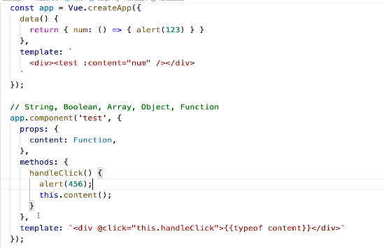

# Vue

## 组件事件封装

```js
const events = eventNames
	.map(evt=> evt.toLocalLowerCase())
	.map(eventName=> ({
        completeName: 'Plotly_'+eventName,
        handler: context => (...args) => {
            context.$emit.apply(context, [eventName, ...args])
        }
    }))
```

```js
mounted() {
    Plotly.newPlot(this.$el, this.data, ...)
	events.forEach(evt => {
        // this.$el  Plotly的Dom元素.on(event, handler)
        this.$el.on(evt.completeName, evt.handler(this))
    })
}
```

## NPM组件发布

https://www.npmjs.com/package/kl-test-data

### 组件添加install方法

```js
// 导入组件，组件必须声明 name
import KlTestData from "./src/KlTestData.vue";

// 为组件提供 install 安装方法，供按需引入
KlTestData.install = function(Vue) {
  Vue.component(KlTestData.name, KlTestData);
};

// 默认导出组件
export default KlTestData;
```

### 插件注册方法

```js
import KlTestData from "./KlTestData";
// 存储组件列表
const components = [KlTestData];

/* 
  定义install 方法，接收Vue作为参数，如果使用use注册插件，则所有的组件都将被注册
*/
const install = function(Vue) {
   // 判断是否安装
  if (install.installed) {
    return;
  }

  components.map(item => {
    Vue.component(item.name, item);
  });
};
// 判断是否引入文件
if (typeof window !== "undefined" && window.Vue) {
  install(window.Vue);
}
export default {
  install,
  KlTestData
};
```

### 组件的使用案例

```js
/* main.js */
// 导入组件库
import ComColorButton from './../packages/index'
// 注册组件库
Vue.use(ComColorButton)
```

### 编译命令行

以下我们在 scripts 中新增一条命令 npm run lib

- --target: 构建目标，默认为应用模式。这里修改为 lib 启用库模式。
- --dest : 输出目录，默认 dist。这里我们改成 lib
- [entry]: 最后一个参数为入口文件，默认为 src/App.vue。这里我们指定编译 packages/ 组件库目录。

```json
"scripts": {
    "lib": "vue-cli-service build --target lib --name vcolorpicker --dest lib packages/index.js"
}
```

### 编译和发布

#### 执行编译库命令

```shell
npm run lib
```

#### npm配置

- private：是否私有，需要修改为 false 才能发布到 npm
- version: 版本号，每次发布至 npm 需要修改版本号，不能和历史版本号相同

```json
{
  "name": "kl-test-data",
  "version": "0.1.1",
  "main": "lib/klTestData.umd.min.js",
  "description": "Component, showing TestData",
  "private": false,
  "author": {
    "name": "Jerry Chen",
    "email": "caffreygo@163.com"
  },
  "keywords": [
    "TestData"
  ],
  "license": "MIT",
}
```

####  .npmignore

```
# 忽略目录
examples/
packages/
public/

# 忽略指定文件
vue.config.js
babel.config.js
*.map
```

#### 发布到npm

```shell
npm login
npm publish
```

## 事件

- 单次点击触发两次事件：`@click=“handleClick1()，habdleClick2()”`
- 不响应子元素的点击：`@click.self`
- `@scroll.passive`增加滚动性能（解决chrome性能警告）
- 键盘修饰符`@keydown.enter deleye`
- 鼠标修饰符`@click.left right middle`
- 精确修饰符, 单独点击ctrl触发`@clock.ctrl.exact`

### V-model修饰符

`v-model. lazy number trim` 

## 组件

### 局部组件

 `components: { name: componentObj }`

### 全局组件

`app. component(name, configObj) `

```js
const component = {
	data() {},
    template: '<div>child component</div>'
}
```

### Function类型的传值



### validator


### 对象多属性传值

```js
data() {
    return {
        params: {
            a: 1,
            b: 2
        }
    }
}
```

下面两种形式等价，直接`v-bind`传递，适合需要多个参数传递给子组件的情况

```html
<child v-bind="params" />

<child :a="params.a" :b="params.b" />
```

### 驼峰属性名

```html
<child data-hello="hello" />
```

子组件使用`dataHello`使用该参数，html不能传**dataHello**这样的属性，只能用**data-hello**

### Non-props | $attrs

::: tip Non-props

1. 父组件向子组件传递属性的时候，子组件不写props属性接受的这些属性；
2. 子组件在接受到这些属性后，会把属性放着子组件**最外层**的**DOM标签**下；
3. 可以设置**inheritAttrs**不写入到DOM (组件的**根元素 继承特性**);
4. 应用：class样式
5. 当子组件根节点不止一个时，将不会自动继承这些属性，可以通过`$attrs`获取

:::

- 父组件

  ```html
  <child msg="hello" />
  ```

- 子组件

  ```
  app.component('child', {
  	template: `<div>child component</div>`
  })
  ```

- 渲染效果

  ```html
  <div msg="hello">child component</div>
  ```

- 有多个根节点时不会写入，使用`$attrs`得到Non-props

  ```js
  app.component('child', {
      template: `
          <div :msg="$attrs.msg">child component</div>
          <div v-bind="$attrs">child component</div>
          <div>child component</div>
  `
  })
  ```

  