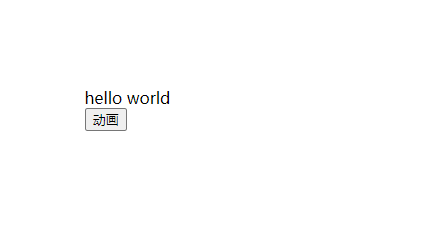
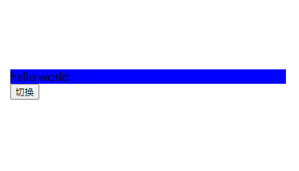
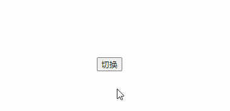

# Vue中的动画

https://cn.vuejs.org/v2/guide/transitions.html

## Vue基础动画和过渡

- 过渡：状态的变化过程
- 动画：元素的运动过程

### 动画animation

通过 `@keyframes` 定义一个动画，然后使用css3的 **animations** 使用该动画



```css
@keyframes leftToRight {
    0% {
        transform: translateX(-100px);
    }
    50% {
        transform: translateX(-50px);
    }
    0% {
        transform: translateX(0px);
    }
}
.animation {
    animation: leftToRight 3s;
}
```

```js
const app = Vue.createApp({
    data() {
        return {
            animate: {
                animation: false
            }
        }
    },
    methods: {
        handleClick() {
            this.animate.animation = !this.animate.animation
        }
    },
    template: `
        <div>
        <div :class="animate">hello world</div>
        <button @click="handleClick">d动画</button>
        </div>
	`
});

const vm = app.mount('#root');
```

### 过渡transition



通过 **transition** 的css属性定义状态、时间和效果

```css
.transition {
    transition: 3s background-color ease;
}
```

```js
const app = Vue.createApp({
    data() {
        return {
            styleObj: {
                background: 'blue'
            }
        }
    },
    methods: {
        handleClick() {
            if(this.styleObj.background === 'blue') {
                this.styleObj.background = 'green';
            }else {
                this.styleObj.background = 'blue'
            }
        }
    },
    template: `
        <div>
        <div class="transition" :style="styleObj">hello world</div>
        <button @click="handleClick">切换</button>
        </div>
	`
});

const vm = app.mount('#root');
```

## 单元素组件动画和过渡

::: tip Transition

​	Vue内置了Transition组件帮助我们快速实现动画和过渡

​	入场：隐藏 => 展示

​	出场：展示 => 隐藏

:::


### 入场出场过渡

::: tip 

`v-if`和`v-show`都可以使用transition标签实现效果

:::


```css
/* 单元素，单组件的入场出场 */
.v-enter-from {
    opacity: 0;
}
.v-enter-active, .v-leave-active {
    transition: opacity 1s ease-out;
}
.v-enter-to {
    opacity: 1;
}
/* 可删除 */
.v-leave-to {
    opacity: 0;
}
```

```js
const app = Vue.createApp({
    data() {
        return {
            show: false,
        };
    },
    methods: {
        handleClick() {
            this.show = !this.show;
        },
    },
    template: `
    <div>
        <transition>
        	<div v-if="show">hello world</div>
        </transition>
        <button @click="handleClick">切换</button>
    </div>
`,
});

const vm = app.mount("#root");
```

### 入场出场动画

- 在关键帧`keyframes`内定义好动画过程

- 在固定的class内使用`animation`应用该动画

- v-enter是默认的动画，可以自定义命名：

  ```html
  <transition name="hello">
      <div v-if="show">hello world</div>
  </transition>
  ```


```css
@keyframes shake {
    0% {
        transform: translateX(-100px)
    }
    50% {
        transform: translateX(-50px)
    }
    100% {
        transform: translateX(50px)
    }
}
.hello-leave-active {
    animation: shake 3s;
}
.hello-enter-active {
    animation: shake 3s;
}
```

## 自定义类名

- enter-from-class
- enter-active-class
- enter-to-class
- leave-from-class
- leave-active-class
- leave-to-class

#### 样式

```css
.bye {
    animation: shake 1s;
}
.hello {
    animation: shake 1s;
}
```

#### 模板

```html
<transition
   enter-active-class="hello"
   leave-active-class="bye"
>
    <div v-if="show">hello world</div>
</transition>
```

## 使用第三方动画库

Animate.css: https://animate.style/ 


1. Head头部引入animate.css

   ```html
   <link
         rel="stylesheet"
         href="https://cdnjs.cloudflare.com/ajax/libs/animate.css/4.1.1/animate.min.css"
         />
   ```

2. 修改active下应用的动画

   ```html
   <transition
       enter-active-class="animate__animated animate__bounce"
       leave-active-class="animate__animated animate__flash"
       >
       <div v-if="show">hello world</div>
   </transition>
   ```

## 动画+过渡

::: tip 

- v-enter-from包含在active内，设置过渡初始为red,active过程将使用过渡效果转化为黑色
- v-enter-from默认为黑色，设置过渡期间为红色即可，(?)最终还是黑色
- type="transition"  如果过渡和动画时间不一致，以过渡时间为统一时间
- :duration="1000" 将过渡和动画时间都设置为1s结束，:duration="{enter:1000, leave:3000}"入场1s出场3s

:::



```css
@keyframes shake {
    0% {
        transform: translateX(-100px)
    }
    50% {
        transform: translateX(-50px)
    }
    100% {
        transform: translateX(50px)
    }
}
.v-enter-from {
    color: red
}
.v-enter-active {
    animation: shake 1s;
    transition: all 1s ease-in;
}
.v-leave-active {
    color: red;
    animation: shake 1s;
    transition: all 1s ease-in;
}
```

## JS动画效果实现

- :css="false" 关闭css的动画效果
- 通过钩子函数定义各个时间点的样式变化函数：`before-enter`、`enter`、`after-enter`
- @enter(el, done) 调用done函数停止动画，然后触发@after-enter
- css动画性能一般会比js动画好一些
- `before-leave`、`leave`、`after-leave`

使用**生命周期钩子**实现js的动画效果


```js
const app = Vue.createApp({
    data() {
        return {
            show: false
        }
    },
    methods: {
        handleClick() {
            this.show = !this.show;
        },
        handleBeforeEnter(el) {
            el.style.color = "red";
        },
        handleEnterActive(el, done) {
            const animation = setInterval(() => {
                const color = el.style.color;
                if(color === 'red') {
                    el.style.color = 'green';
                } else {
                    el.style.color = 'red';
                }
            }, 1000)
            setTimeout(() => {
                clearInterval(animation);
                done();
            }, 3000)
        },
        handleEnterEnd(el) {
            alert(123);
        }
    },
    template: `
    <div>
        <transition
            :css="false"
            @before-enter="handleBeforeEnter"
            @enter="handleEnterActive"
            @after-enter="handleEnterEnd"
            >
        <div v-show="show">hello world</div>
        	</transition>
        <button @click="handleClick">切换</button>
    </div>
`
});

const vm = app.mount('#root');
```

## 多个元素和组件切换

- 切换效果主要借助于`v-if`和`v-else`，切换时展示效果；
- 组件可以使用动态组件`component`切换
- mode="out-in"实现先隐藏再展示（避免出场入场动画同时显示）
- appear属性实现初始加载时也有动画


1. 过渡样式效果定义

   ```css
   .v-leave-to,
   .v-enter-from {
       opacity: 0;
   }
   .v-enter-active,
   .v-leave-active {
       transition: opacity 1s ease-in;
   }
   .v-leave-from,
   .v-enter-to {
       opacity: 1;
   }
   ```

2. 组件或元素切换

   ```js
   const ComponentA = {
       template: "<div>hello world</div>",
   };
   
   const ComponentB = {
       template: "<div>bye world</div>",
   };
   
   const app = Vue.createApp({
       data() {
           return { component: "component-a" };
       },
       methods: {
           handleClick() {
               if (this.component === "component-a") {
                   this.component = "component-b";
               } else {
                   this.component = "component-a";
               }
           },
       },
       components: {
           "component-a": ComponentA,
           "component-b": ComponentB,
       },
       template: `
       <div>
           <transition mode="out-in" appear>
           	<component :is="component" />
           </transition>
           <button @click="handleClick">切换</button>
       </div>
   `,
   });
   
   const vm = app.mount("#root");
   ```

## 列表动画


1. 定义**入场动画**（**v-enter**）和**移动过渡**效果的样式名（**v-move）**

   ```css
   .v-enter-from {
       opacity: 0;
       transform: translateY(30px);
   }
   .v-enter-active {
       transition: all .5s ease-in;
   }
   .v-enter-to {
       opacity: 1;
       transform: translateY(0);
   }
   .v-move {
       transition: all .5s ease-in;
   }
   .list-item {
       display: inline-block;
       margin-right: 10px;
   }
   ```

2. 增加列表项

   ```js
   const app = Vue.createApp({
       data() {
           return { list: [1, 2, 3] }
       },
       methods: {
           handleClick() {
               this.list.unshift(this.list.length + 1);
           },
       },
       template: `
       <div>
           <transition-group>
           	<span class="list-item" v-for="item in list" :key="item">{{item}}</span>
           </transition-group>
           <button @click="handleClick">增加</button>
       </div>
   `
   });
   
   const vm = app.mount('#root');
   ```

## 状态动画

状态动画实际上就是通过js的数据变化处理


```js
const app = Vue.createApp({
    data() {
        return {
            number: 1,
            animateNumber: 1,
        };
    },
    methods: {
        handleClick() {
            this.number = 10;
            if (this.animateNumber < this.number) {
                const animation = setInterval(() => {
                    this.animateNumber += 1;
                    if (this.animateNumber === 10) {
                        clearInterval(animation);
                    }
                },100);
            }
        },
    },
    template: `
    <div>
    	<div>{{animateNumber}}</div>
    	<button @click="handleClick">增加</button>
    </div>
`,
});

const vm = app.mount("#root");
```

